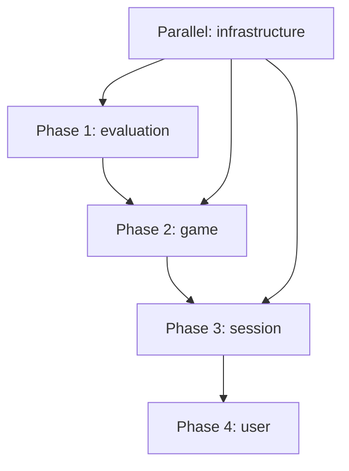

# ARCHITECTURE REFACTORING - EndgameTrainer

> **Status:** Analysis Complete | **Target:** Domain-Driven Design  
> **Analysiert:** 2025-08-17 | **Nächste Schritte:** Phase 1 - Evaluation Domain

---

## 🎯 THE BIG PICTURE - Was macht die App wirklich?

### **Kern-Funktionalität:**
1. **Schach-Endspiel-Trainer** - Nutzer üben vordefinierte Endspiel-Positionen
2. **Tablebase-Integration** - Lichess API zeigt optimale Züge für Endspiele  
3. **Training mit Feedback** - Nutzer macht Zug → Tablebase bewertet → UI zeigt Qualität

### **Tatsächliche Nutzung:**
- User navigiert zu `/train/1` oder `/train/2` (nur 2 Positionen existieren!)
- Lädt eine Position aus hardcoded Daten
- User macht Züge auf dem Brett
- Tablebase API bewertet jeden Zug
- UI zeigt ob der Zug optimal/gut/schlecht war

### **Zukünftige Anforderungen:**
- ✅ **Firebase** - Für echte Positions-Datenbank (User will das reaktivieren)
- ✅ **Android App** - React Native geplant (User bestätigt)
- ✅ **Learning Tracking** - Fortschritt & Spaced Repetition
- ✅ **Multi-User** - Profile & Cloud-Sync

---

## ❌ AKTUELLE PROBLEME - Code-Analyse Erkenntnisse

### **🔴 Kritische Service-Layer Probleme:**

#### 1. TablebaseService Duplikation (6 Varianten)
```
/features/tablebase/services/TablebaseService.ts     (381 LOC - Alt)
/shared/services/TablebaseService.ts                 (641 LOC - Neu, optimiert)
/shared/services/TablebaseService.e2e.mocks.ts      (462 LOC, 12KB)
/shared/services/__mocks__/TablebaseService.ts       (324 LOC, 8.4KB)  
/tests/mocks/TablebaseServiceMockFactory.ts         (251 LOC, 6.8KB)
/tests/__mocks__/tablebaseService.ts                (68 LOC)
```
**Problem:** API-Änderungen müssen in 4+ Mock-Dateien gepflegt werden

#### 2. Service Export Explosion
- **111 Service Exports** über 35 Service-Dateien (nicht 45 wie Issue behauptet)
- Viele Services ungenutzt oder nur für Tests
- Keine klaren Grenzen zwischen Domänen

#### 3. Falsche Feature-Grenzen
```
/features/chess-core/    → Fast leer (nur Services ohne echte Exports)
/features/tablebase/     → Nur alte TablebaseService Implementation 
/features/training/      → Fast leer (nur Tests!)
```
**Problem:** Technische statt fachliche Abgrenzung

### **🟡 Architektur-Probleme:**

#### 4. /shared Müllhalde (111 Exports)
Alles landet in `/shared` weil Features nicht richtig abgegrenzt sind:
```
/shared/services/platform/     # Web-Abstraktion (richtig für Mobile)
/shared/services/database/     # Firebase-Wrapper (richtig, noch inaktiv)
/shared/services/orchestrator/ # Überengineered für simple Operationen
```

#### 5. TrainingSlice Monolith
- Vermischt State + Actions + Business Logic
- Schwer testbar
- Verletzt Single Responsibility

---

## ✅ WAS IST KEIN OVERENGINEERING

### **Behalten für zukünftige Erweiterungen:**

1. **PlatformService** ✅ - **BEHALTEN!** 
   - Web: localStorage/sessionStorage
   - Android: AsyncStorage oder SQLite
   - Abstraktion macht Sinn für Multi-Platform

2. **Firebase Integration** ✅ - **BEHALTEN & AKTIVIEREN!**
   - Aktuell deaktiviert aber vorbereitet
   - Wird für echte Positionen-Datenbank gebraucht
   - Cloud-Sync zwischen Web & Mobile

3. **Database Services** ✅ - **BEHALTEN!**
   - `IPositionService` Interface ist richtig
   - `serverPositionService` für Firebase
   - Mock-Implementation für Tests

---

## 🏗️ NEUE ARCHITEKTUR - Domain-Driven Design

### **Problem der aktuellen Struktur:**
- Features basieren auf **technischen**, nicht **fachlichen** Grenzen
- Die App handelt von: **Positionen**, **Zügen**, **Bewertungen** und **Lernfortschritt**
- Nicht von: "chess-core", "tablebase", "training"

### **Neue Domain-Driven Struktur:**

```
src/
├── domains/                    # 🆕 Fachliche Domänen
│   ├── game/                  # Schach-Kern-Domäne
│   │   ├── services/          # ChessEngine, PositionManager
│   │   ├── types/             # Position, Move, GameState
│   │   ├── utils/             # FEN validation, move parsing
│   │   └── index.ts           # Public API
│   │
│   ├── evaluation/            # Bewertungs-Domäne
│   │   ├── services/          # TablebaseService (NUR EINE!)
│   │   ├── types/             # MoveQuality, Analysis, TablebaseResult
│   │   ├── cache/             # LRU Cache implementation
│   │   └── index.ts           # Public API
│   │
│   ├── session/               # Training-Session-Domäne
│   │   ├── services/          # TrainingService (orchestration)
│   │   ├── store/             # Zustand Slices (slim)
│   │   ├── types/             # SessionState, Progress
│   │   └── index.ts           # Public API
│   │
│   └── user/                  # 🔮 Future: User-Profile-Domäne
│       ├── services/          # UserService, ProgressService
│       ├── types/             # User, Profile, Settings
│       └── README.md          # Placeholder für später
│
├── platform/                  # 🔧 Platform-Abstraktion
│   ├── web/                   # Web-spezifische Implementierungen
│   │   ├── storage.ts         # localStorage/sessionStorage
│   │   └── apis.ts            # DOM APIs, Web APIs
│   ├── mobile/                # 🔮 Future: React Native
│   │   ├── storage.ts         # AsyncStorage
│   │   └── apis.ts            # Native APIs
│   └── index.ts               # Platform detection & API
│
├── infrastructure/            # 🔧 Technische Services
│   ├── api/                   # HTTP clients
│   │   ├── LichessApiClient.ts
│   │   └── HttpProvider.ts
│   ├── storage/               # Persistence
│   │   ├── firebase/          # Firebase setup
│   │   └── cache/             # Cache implementations
│   ├── logging/               # Logger service
│   └── index.ts               # Infrastructure exports
│
├── ui/                        # 🎨 Presentation Layer
│   ├── components/            # React Components (von shared/ verschoben)
│   ├── hooks/                 # Custom Hooks  
│   ├── pages/                 # Page Components
│   └── styles/                # Tailwind, CSS
│
└── app/                       # 📄 Next.js App Router (bleibt)
    ├── layout.tsx
    ├── page.tsx
    └── train/[id]/page.tsx
```

### **Warum Domain-Driven besser ist:**

1. **🎯 Klare fachliche Grenzen** - Code ist wo man ihn erwartet
2. **🔄 Unabhängige Evolution** - Jede Domäne entwickelt sich isoliert
3. **📱 Mobile-Ready** - Platform-Abstraktion bereits getrennt
4. **☁️ Firebase-Ready** - Jede Domäne hat eigene Data Layer
5. **🧠 Einfaches Mental Model** - Entwickler denken in Geschäftskonzepten
6. **🧪 Bessere Testbarkeit** - Isolierte Domänen, klare Abhängigkeiten

---

## 🚀 MIGRATIONS-STRATEGIE - Inkrementell & Sicher

### **🎯 Reihenfolge nach Abhängigkeiten:**



### **Phase 1: Evaluation Domain** (Start hier - am isoliertesten!)

**Ziel:** TablebaseService konsolidieren + Mock-Strategie vereinheitlichen

```bash
# 1. Struktur erstellen
mkdir -p src/domains/evaluation/{services,types,cache}

# 2. TablebaseService konsolidieren
# Behalten: /shared/services/TablebaseService.ts (641 LOC, optimiert)
# Löschen: /features/tablebase/services/ (381 LOC, veraltet)

# 3. Mock-Strategie vereinheitlichen  
# Behalten: __mocks__/TablebaseService.ts (Vitest)
# Löschen: 4 andere Mock-Varianten
```

**Vorher:**
```
2 Implementierungen + 4 Mock-Varianten = 6 Dateien
```

**Nachher:**
```
1 Implementation + 1 Mock = 2 Dateien (-67%)
```

### **Phase 2: Game Domain**

**Ziel:** Chess-Logic aus `/shared/utils` + TrainingSlice extrahieren

```bash
# 1. Chess.js Wrapper isolieren
mkdir -p src/domains/game/{services,types,utils}

# 2. Pure Functions extrahieren
# Von: /shared/utils/chess/
# Nach: /domains/game/utils/

# 3. Position Management
# Von: TrainingSlice 
# Nach: /domains/game/services/PositionService.ts
```

### **Phase 3: Session Domain**

**Ziel:** TrainingSlice aufteilen + Orchestration extrahieren

```bash
# 1. TrainingService erstellen
mkdir -p src/domains/session/{services,store,types}

# 2. Business Logic extrahieren
# Von: TrainingSlice (1010 LOC!)
# Nach: TrainingService (orchestration)
#       + Slim TrainingSlice (nur state)

# 3. Orchestrators vereinfachen
# Von: /shared/store/orchestrators/ (overengineered)
# Nach: TrainingService methods
```

### **Phase 4: Infrastructure Cleanup**

**Parallel zu anderen Phasen:**

```bash
# 1. API clients verschieben
# Von: /shared/services/api/
# Nach: /infrastructure/api/

# 2. Firebase setup
# Von: /shared/lib/firebase/
# Nach: /infrastructure/storage/firebase/

# 3. Logging konsolidieren
# Von: /shared/services/logging/
# Nach: /infrastructure/logging/
```

---

## 📊 ERWARTETE VERBESSERUNGEN

### **Zahlen & Reduktionen:**

| Bereich | Vorher | Nachher | Reduktion |
|---------|--------|---------|-----------|
| **TablebaseService Implementierungen** | 2 | 1 | -50% |
| **Mock-Dateien** | 5 | 1-2 | -60-80% |
| **Service Exports** | 111 | ~40 | -64% |
| **Gelöschte LOC** | - | ~1500-2000 | - |
| **Leere Feature-Module** | 3 | 0 | -100% |

### **Qualitäts-Verbesserungen:**

- ✅ **Klare Verantwortlichkeiten** - Jede Domäne hat einen Zweck
- ✅ **Einfachere Tests** - Isolierte Domänen, weniger Mocks
- ✅ **Bessere Wartbarkeit** - API-Änderungen nur in einer Datei
- ✅ **Erweiterbarkeit** - Neue Features haben klaren Platz
- ✅ **Entwickler-Experience** - Code ist wo man ihn erwartet

---

## ✅ WAS BLEIBT - Bewährte Strukturen

### **Nicht anfassen:**

1. **✅ Zustand Store** - Funktioniert gut, nur schlanker machen
2. **✅ Platform Abstraktion** - Richtig für Mobile-Support  
3. **✅ Firebase Vorbereitung** - Kann jederzeit aktiviert werden
4. **✅ UI Components** - Nur verschieben, nicht ändern
5. **✅ Next.js App Router** - Perfekt wie es ist
6. **✅ Testing Setup** - Vitest + MSW bleibt

### **Nur verschieben, nicht ändern:**

- React Components (`/shared/components` → `/ui/components`)
- Service Implementierungen (neue Ordner, gleiche Logic)
- Store Slices (schlanker machen, aber nicht brechen)

---

## ❌ WAS WEGFÄLLT - Aufräumen & Konsolidieren

### **Definitiv löschen:**

```bash
# 1. Duplikate
/features/tablebase/services/                    # Alte TablebaseService
/shared/services/TablebaseService.e2e.mocks.ts  # E2E Mocks
/tests/mocks/TablebaseServiceMockFactory.ts     # Factory Pattern
/tests/__mocks__/tablebaseService.ts            # Zusätzliche Mocks

# 2. Leere Module  
/features/chess-core/                           # Fast leer
/features/training/                             # Nur Tests

# 3. Ungenutzte Services (nach Analyse)
/shared/services/test/                          # Test-only services
/shared/services/orchestrator/                  # Überengineert
```

### **Zahlen:**
- **Gelöschte Dateien:** ~15-20
- **Gelöschte LOC:** ~1500-2000  
- **Service Exports:** 111 → ~40

---

## 🚨 RISIKEN & MITIGATIONEN

### **Hauptrisiken:**

1. **Tests brechen** → Schrittweise Migration mit CI/CD
2. **Import-Chaos** → Automated Search & Replace Tools
3. **Funktionalität bricht** → Phase für Phase mit Rollback-Plan
4. **Team-Verwirrung** → Diese Dokumentation + Code Reviews

### **Mitigationen:**

```bash
# 1. Backup vor jeder Phase
git checkout -b backup-before-phase-1

# 2. Tests nach jeder Änderung
pnpm test

# 3. Stufenweise Commits
git commit -m "Phase 1.1: Create evaluation domain structure"
git commit -m "Phase 1.2: Move TablebaseService to evaluation domain"
git commit -m "Phase 1.3: Update all imports to new TablebaseService"
```

---

## 🎯 NEXT STEPS - Konkrete Aktionen

### **Sofort starten:**

1. **Phase 1: Evaluation Domain**
   ```bash
   mkdir -p src/domains/evaluation/{services,types,cache}
   cp src/shared/services/TablebaseService.ts src/domains/evaluation/services/
   # Update imports step by step
   ```

2. **Backup & Safety**
   ```bash
   git checkout -b architecture-refactoring
   git add -A && git commit -m "Backup before architecture refactoring"
   ```

3. **Test alles vorher**
   ```bash
   pnpm test
   pnpm run lint
   pnpm run type-check
   ```

### **Erfolgs-Kriterien:**

- ✅ Alle Tests bestehen nach jeder Phase
- ✅ Build erfolgreich nach jeder Phase  
- ✅ Keine funktionalen Regressionen
- ✅ Imports funktionieren korrekt
- ✅ Performance bleibt gleich oder besser

---

**🎯 TL;DR:** Domain-Driven Design statt Feature-Chaos. Schritt für Schritt. Tests first. Bewährtes behalten, Duplikate weg, klare Grenzen schaffen.