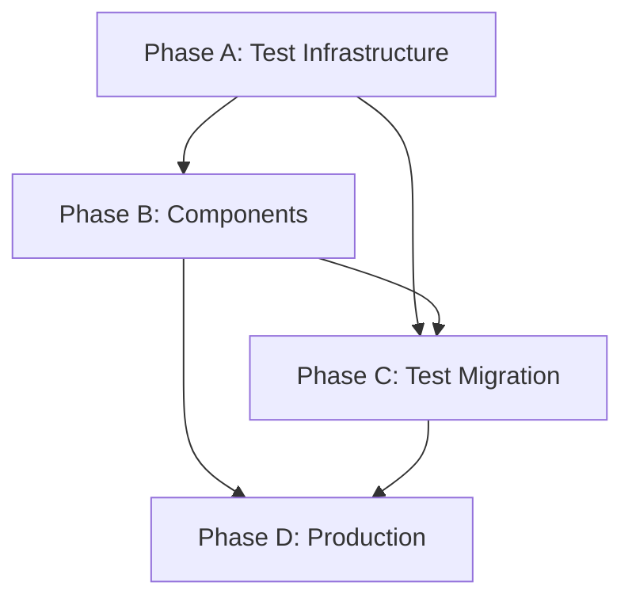

# Firebase Migration & Test Architecture Integration TODO

## Aktueller Stand (2025-01-11)

### ✅ Abgeschlossen:
- Phase 1: Firebase Emulator Setup (teilweise)
- Phase 2: Clean Cut Implementation (VOLLSTÄNDIG - Dual-Read Pattern entfernt)
- Enterprise Test Architecture implementiert (aber noch nicht in Verwendung!)

### ❌ Noch offen:
- Component Migration (nur 2 von ~20 Komponenten async)
- Test Migration auf neue Architecture
- Firebase-spezifische Tests
- Production Readiness

## Neue Granulare TODO-Liste (45 Schritte)

### Phase A: Firebase Test Infrastructure aktivieren (8 Schritte)

A.1. Create Firebase test suite using new architecture: tests/e2e/firebase/
A.2. Integrate firebase-test-helpers.ts with new Test API Server
A.3. Add Firebase emulator startup to global-setup.ts
A.4. Create FirebaseTestFixture extending base fixtures
A.5. Implement data seeding via Test API endpoints
A.6. Add Firebase-specific Page Objects (FirestoreDebugPage)
A.7. Create test for positionService with real Firestore queries
A.8. Verify emulator cleanup between tests

### Phase B: Component Migration abschließen (15 Schritte)

B.1. Create LoadingState component: shared/components/common/LoadingState.tsx
B.2. Create ErrorBoundary component: shared/components/common/ErrorBoundary.tsx
B.3. Migrate HomePage.tsx to async pattern with loading/error states
B.4. Migrate AdvancedEndgameMenu.tsx to async data fetching
B.5. Migrate CategoryView components to use positionService
B.6. Update TrainingPageZustand to handle async position loading
B.7. Migrate all DualEvaluationPanel components to async
B.8. Add useAsyncData hook for consistent loading patterns
B.9. Create withAsyncData HOC for legacy components
B.10. Update NavigationControls for async position navigation
B.11. Migrate PositionSelector to async category/chapter loading
B.12. Add error recovery UI for failed Firebase requests
B.13. Implement retry logic in UI components
B.14. Add loading skeletons for better UX
B.15. Test all migrated components with Firebase emulator

### Phase C: Test Migration auf neue Architecture (12 Schritte)

C.1. Migrate training-happy-path.spec.ts to use TrainingPage POM
C.2. Replace ModernDriver with new Page Objects in all tests
C.3. Update test helpers to use TestApiClient
C.4. Convert window.__testHooks calls to Test API calls
C.5. Implement visual regression tests for loading states
C.6. Add accessibility tests for async UI patterns
C.7. Create performance tests with PerformanceTester
C.8. Add fault injection tests for Firebase failures
C.9. Implement chaos testing for network issues
C.10. Use test tagging system (@firebase, @async, etc.)
C.11. Create data-driven tests with PositionFactory
C.12. Add test monitoring and reporting

### Phase D: Production Readiness (10 Schritte)

D.1. Performance test with 1000+ positions in Firestore
D.2. Test Firebase security rules with different user roles
D.3. Implement client-side caching strategy
D.4. Add Firebase Performance Monitoring
D.5. Set up error tracking (Sentry integration)
D.6. Create production deployment checklist
D.7. Update all documentation (README, ARCHITECTURE, etc.)
D.8. Add Firebase backup/restore procedures
D.9. Implement graceful degradation for Firebase outages
D.10. Final security audit and penetration testing

## Priorisierung

### Sofort (diese Woche):
- Phase A: Firebase Test Infrastructure (kritisch für alles weitere)
- B.1-B.3: Loading/Error States (User Experience)

### Nächste Woche:
- Rest von Phase B: Component Migration
- C.1-C.5: Core Test Migration

### Übernächste Woche:
- Rest von Phase C: Advanced Testing
- Phase D: Production Readiness

## Abhängigkeiten

## Erfolgsmetriken

- ✅ Alle Komponenten nutzen async/await
- ✅ 100% der Tests nutzen neue Architecture
- ✅ Firebase-Tests mit >90% Coverage
- ✅ Ladezeiten <2s für alle Seiten
- ✅ Graceful Error Handling überall
- ✅ Keine synchronen Daten-Zugriffe mehr

## Rollback-Plan

1. Git branch `backup/pre-migration` existiert bereits
2. Firebase-Daten bleiben erhalten
3. Dual-Read Pattern kann reaktiviert werden
4. Test Architecture ist unabhängig und kann bleiben

## Notes

- Enterprise Test Architecture ist bereits implementiert aber wird noch nicht genutzt
- Priorität ist es, die bestehende Arbeit zu nutzen statt neue Patterns zu erfinden
- Firebase Security Rules müssen noch erweitert werden für User-Daten
- Performance-Monitoring von Anfang an einbauen