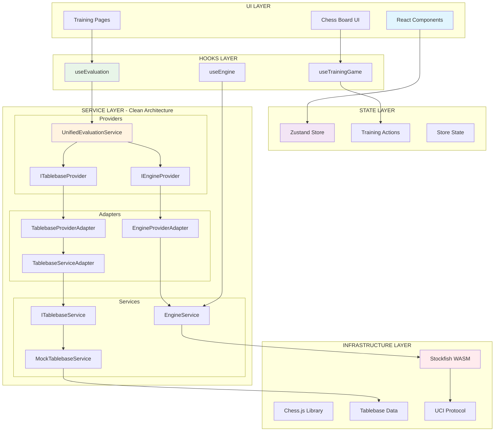

# System Architecture

**Target**: LLM comprehension for AI-assisted development
**Environment**: WSL + VS Code + Windows
**Updated**: 2025-07-13
**Status**: Web-only architecture (React Native components removed)

## 🏗️ High-Level Architecture



## 🎯 Clean Architecture Implementation

### Service Layer
```typescript
// Location: /shared/services/
ITablebaseService → MockTablebaseService
IPositionService → PositionService
EngineService (singleton pattern)
PlatformService → WebPlatformService
```

### Adapter Layer
```typescript
// Location: /shared/lib/chess/evaluation/
TablebaseServiceAdapter
EngineProviderAdapter
TablebaseProviderAdapter
cacheAdapter
```

### Provider Layer
```typescript
// Location: /shared/lib/chess/evaluation/providers.ts
IEngineProvider
ITablebaseProvider
ICacheProvider
ParallelEvaluationService
```

## 📊 Core Data Flows

### 1. Evaluation Pipeline
```
Position (FEN) 
  → UnifiedEvaluationService
    → EngineProvider + TablebaseProvider
      → Adapters (EngineProviderAdapter, TablebaseProviderAdapter)
        → Services (Engine, TablebaseService)
          → Infrastructure (Stockfish, Mock/Real Tablebase)
            → Unified Result
              → UI Components
```

### 2. State Management Flow
```
User Interaction 
  → Component Event Handler
    → Store Action (trainingActions.ts)
      → Store State Update (store.ts)
        → Component Re-render
```

### 3. Engine Communication
```
Position Request
  → Engine Singleton
    → Worker Manager
      → Stockfish WASM Worker
        → UCI Protocol
          → UCI Parser
            → Structured Evaluation
              → Provider Adapter
                → Unified Service
```

## 🔧 Key Architectural Decisions

### 1. Singleton Pattern for Engine
**File**: `/shared/lib/chess/engine/singleton.ts`
**Reason**: Browser memory optimization (~20MB per worker)
**Implementation**: Single Stockfish instance across application

### 2. Unified Evaluation Service
**File**: `/shared/lib/chess/evaluation/unifiedService.ts`
**Purpose**: Single entry point for all evaluation requests
**Benefits**: Consistent interface, caching, error handling

### 3. Clean Architecture Layers
**Service → Adapter → Provider**
- Services: Business logic and data access
- Adapters: Interface conversion and protocol handling
- Providers: Infrastructure abstractions

### 4. Zustand Store as Single Source of Truth
**File**: `/shared/store/store.ts`
**Pattern**: Centralized state management
**Benefits**: Predictable state updates, easy debugging

## 📁 Directory Structure Mapping

```
/shared/
├── components/           # UI Layer - React components
│   ├── chess/           # Chess-specific UI components
│   ├── layout/          # Layout and structure components
│   ├── navigation/      # Navigation components
│   ├── training/        # Training-specific components
│   └── ui/             # Generic UI components
├── hooks/               # Hooks Layer - Business logic hooks
├── lib/                 # Service Layer - Core libraries
│   ├── cache/          # Caching infrastructure
│   ├── chess/          # Chess engine and evaluation
│   │   ├── engine/     # Engine infrastructure
│   │   └── evaluation/ # Evaluation pipeline
│   └── firebase/       # Firebase configuration
├── services/           # Service Layer - Business services
│   ├── chess/          # Chess services
│   ├── database/       # Database services
│   ├── platform/       # Platform abstraction
│   └── tablebase/      # Tablebase services
├── store/              # State Layer - Zustand store
└── types/              # Type definitions across layers
```

## 🎨 Pattern Implementation

### Clean Architecture Pattern
```typescript
// Service Interface
interface ITablebaseService {
  lookupPosition(fen: string): Promise<TablebaseLookupResult | null>;
}

// Service Implementation
class MockTablebaseService implements ITablebaseService {
  async lookupPosition(fen: string): Promise<TablebaseLookupResult | null> {
    // Implementation details
  }
}

// Adapter Layer
class TablebaseServiceAdapter {
  constructor(private service: ITablebaseService) {}
  
  async getEvaluation(fen: string, player: 'w' | 'b'): Promise<TablebaseResult | null> {
    // Adapter logic
  }
}

// Provider Layer
class TablebaseProviderAdapter implements ITablebaseProvider {
  // Provider implementation
}
```

### Evaluation Pipeline Pattern
```typescript
// Unified entry point
class UnifiedEvaluationService {
  constructor(
    private engineProvider: IEngineProvider,
    private tablebaseProvider: ITablebaseProvider,
    private cache: ICacheProvider
  ) {}
  
  async getFormattedEvaluation(fen: string, perspective: 'w' | 'b') {
    // Unified evaluation logic
  }
}
```

## 🔄 Current Tech Stack (Updated)

### Frontend Framework
- **Next.js 15.3**: React framework with App Router (modern architecture)
- **React 18.3**: Component library with concurrent features
- **TypeScript 5.3**: Strict mode enabled for type safety

### State Management
- **Zustand 4.4**: Lightweight state management (single source of truth)
- **Immer Middleware**: Immutable state updates
- **Persist Middleware**: LocalStorage integration

### Chess Engine
- **Stockfish WASM**: NNUE-enabled chess engine
- **chess.js 1.0.0-beta.6**: Chess game logic library
- **UCI Protocol**: Universal Chess Interface for engine communication

### UI & Styling
- **Tailwind CSS 3.4**: Utility-first CSS framework
- **Radix UI**: Accessible component primitives
- **react-chessboard 4.3**: Chess board component

### Testing Framework
- **Jest 29.7**: Unit testing framework (1015 tests passing)
- **React Testing Library 14.1**: Component testing utilities
- **Playwright**: End-to-end testing framework (33 tests passing)

### Development Tools
- **ESLint**: Code linting and formatting
- **CI/CD Pipeline**: Automated testing and deployment
- **Firebase Firestore**: Optional database (with fallback)

## 🚀 Performance Characteristics

### Engine Management
- **Single Instance**: One Stockfish worker maximum
- **Memory Constraint**: ~20MB per worker optimized for browsers
- **Cleanup**: Always call `engine.quit()` on unmount

### Evaluation Caching
- **LRU Cache**: 200 items maximum
- **Debouncing**: 300ms for user inputs
- **Cache Keys**: Position-based with perspective

### Tablebase Performance
- **Mock Service**: Instant responses for development
- **Caching**: TTL-based caching (3600s default)
- **Timeout**: 2000ms per lookup

## 🔍 Integration Points

### Next.js Integration
- **App Router**: `/app/train/[id]/page.tsx` - Main training interface
- **Root Layout**: `/app/layout.tsx` - App-wide configuration and providers
- **Providers**: `/app/providers.tsx` - Client-side providers (app-ready signal)
- **Static Assets**: Stockfish WASM files in `/public`
- **Config**: `/config/constants.ts` - Centralized configuration

### Worker Integration
- **Stockfish Worker**: Browser Web Worker for chess engine
- **Message Protocol**: UCI (Universal Chess Interface)
- **Parser**: Custom UCI message parser

### Testing Integration
- **Unit Tests**: Jest + React Testing Library (1015 tests passing)
- **E2E Tests**: Playwright with stabilized architecture (33/33 passing)
- **Mock Strategy**: MockEngineService for deterministic tests
- **Coverage**: Business logic ≥78% coverage requirement
- **Test Organization**: `/tests/unit/`, `/tests/e2e/`, `/tests/integration/`

## 🛡️ Error Handling Strategy

### Error Boundaries
- **Engine Errors**: EngineErrorBoundary component
- **General Errors**: ErrorBoundary component
- **Service Errors**: Graceful fallbacks with null returns

### Error Service
- **Centralized Logging**: ErrorService.logError()
- **Context Preservation**: Error context tracking
- **User Experience**: Graceful degradation

---

**Next**: Review [DATA_FLOWS.md](./DATA_FLOWS.md) for detailed data flow analysis.