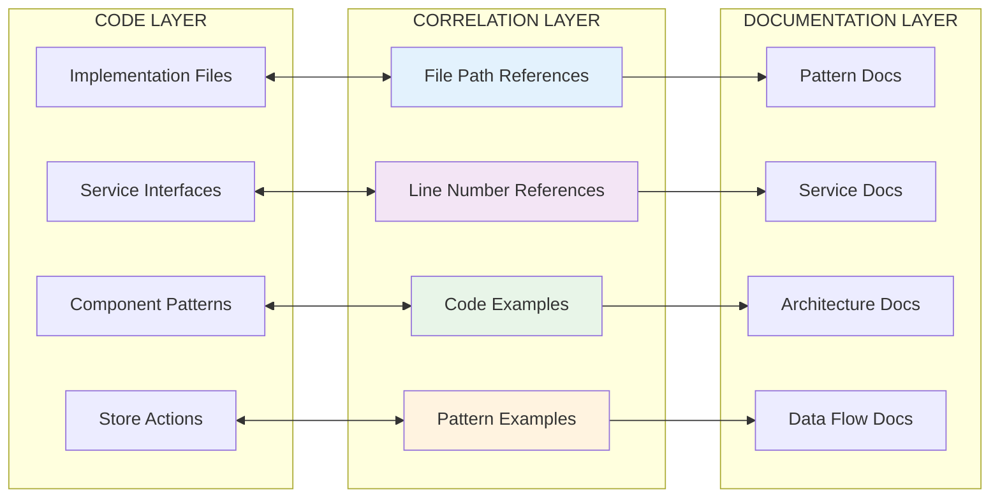

# Code-to-Documentation Correlation Strategies

**Target**: LLM comprehension for maintaining accurate code-documentation correlation
**Environment**: WSL + VS Code + Windows
**Updated**: 2025-07-13

## 🎯 Correlation Principles

### 1. Bidirectional Traceability



## 📍 Reference Formats

### 1. File Path References

**Format**: `/absolute/path/to/file.ts:startLine-endLine`

**Examples**:
```markdown
**File**: `/shared/lib/chess/evaluation/unifiedService.ts:45-75`
**File**: `/shared/hooks/useEvaluation.ts:137-180`
**File**: `/shared/components/training/TrainingBoard/index.tsx:25-60`
```

**Validation Script**:
```javascript
// Check if file exists and lines are valid
function validateFileReference(reference) {
  const [filePath, lineRange] = reference.split(':');
  
  if (!fs.existsSync(path.resolve(filePath))) {
    return { valid: false, error: `File not found: ${filePath}` };
  }
  
  if (lineRange) {
    const [start, end] = lineRange.split('-').map(Number);
    const fileContent = fs.readFileSync(path.resolve(filePath), 'utf8');
    const totalLines = fileContent.split('\n').length;
    
    if (start > totalLines || end > totalLines) {
      return { valid: false, error: `Line range ${lineRange} exceeds file length ${totalLines}` };
    }
  }
  
  return { valid: true };
}
```

### 2. Code Example Correlation

**Pattern**: Code blocks with explicit file correlation
```markdown
**File**: `/shared/store/trainingActions.ts:20-45`
```typescript
export const trainingActions = (set: any, get: any) => ({
  makeMove: (move: Move) => {
    set((state) => {
      const newPosition = new Chess(state.position.fen());
      // ... implementation
    });
  }
});
```

**Automation**: Extract and validate code examples
```javascript
function validateCodeExample(docFile, filePath, lineRange, codeExample) {
  const [startLine, endLine] = lineRange.split('-').map(Number);
  const actualCode = extractCodeFromFile(filePath, startLine, endLine);
  
  // Normalize whitespace and comments for comparison
  const normalizedExample = normalizeCode(codeExample);
  const normalizedActual = normalizeCode(actualCode);
  
  return {
    matches: normalizedActual.includes(normalizedExample.substring(0, 200)),
    similarity: calculateSimilarity(normalizedExample, normalizedActual)
  };
}
```

### 3. Pattern Implementation Mapping

**File**: `/docs/patterns/pattern-mapping.json`
```json
{
  "react-patterns": {
    "container-presentation": {
      "documentation": "/docs/patterns/REACT_PATTERNS.md:82-176",
      "implementations": [
        "/shared/components/training/TrainingBoard/TrainingBoardZustand.tsx:25-60",
        "/shared/components/training/AnalysisPanel/AnalysisDetails.tsx:20-65"
      ],
      "last_validated": "2025-07-13T10:30:00Z"
    },
    "compound-components": {
      "documentation": "/docs/patterns/REACT_PATTERNS.md:178-207",
      "implementations": [
        "/shared/components/training/DualEvaluationPanel/index.tsx:20-55"
      ],
      "last_validated": "2025-07-13T10:30:00Z"
    }
  },
  "zustand-patterns": {
    "store-definition": {
      "documentation": "/docs/patterns/ZUSTAND_PATTERNS.md:74-156",
      "implementations": [
        "/shared/store/store.ts:15-80"
      ],
      "last_validated": "2025-07-13T10:30:00Z"
    }
  }
}
```

## 🔄 Correlation Maintenance Workflows

### 1. Automated Reference Validation

**File**: `/scripts/validate-references.js`
```javascript
#!/usr/bin/env node
/**
 * Validates all file and line references in documentation
 */

const fs = require('fs');
const path = require('path');
const glob = require('glob');

class ReferenceValidator {
  constructor() {
    this.errors = [];
    this.warnings = [];
  }
  
  validateAllReferences() {
    const docFiles = glob.sync('docs/**/*.md');
    
    docFiles.forEach(docFile => {
      this.validateDocumentReferences(docFile);
    });
    
    this.generateReport();
  }
  
  validateDocumentReferences(docFile) {
    const content = fs.readFileSync(docFile, 'utf8');
    
    // Find all file path references
    const fileRefPattern = /`([^`]*\.tsx?):(\d+)-(\d+)`/g;
    let match;
    
    while ((match = fileRefPattern.exec(content)) !== null) {
      const [fullMatch, filePath, startLine, endLine] = match;
      this.validateReference(docFile, filePath, startLine, endLine, fullMatch);
    }
    
    // Find all standalone file references
    const standalonePath = /`([^`]*\.tsx?)`/g;
    while ((match = standalonePath.exec(content)) !== null) {
      const [fullMatch, filePath] = match;
      if (!fullMatch.includes(':')) {
        this.validateFileExists(docFile, filePath, fullMatch);
      }
    }
  }
  
  validateReference(docFile, filePath, startLine, endLine, reference) {
    const fullPath = path.resolve(filePath);
    
    if (!fs.existsSync(fullPath)) {
      this.errors.push({
        file: docFile,
        reference,
        error: `File not found: ${filePath}`
      });
      return;
    }
    
    const fileContent = fs.readFileSync(fullPath, 'utf8');
    const totalLines = fileContent.split('\n').length;
    const start = parseInt(startLine);
    const end = parseInt(endLine);
    
    if (start > totalLines) {
      this.errors.push({
        file: docFile,
        reference,
        error: `Start line ${start} exceeds file length ${totalLines}`
      });
    } else if (end > totalLines) {
      this.warnings.push({
        file: docFile,
        reference,
        warning: `End line ${end} exceeds file length ${totalLines}`
      });
    }
  }
  
  validateFileExists(docFile, filePath, reference) {
    const fullPath = path.resolve(filePath);
    
    if (!fs.existsSync(fullPath)) {
      this.errors.push({
        file: docFile,
        reference,
        error: `File not found: ${filePath}`
      });
    }
  }
  
  generateReport() {
    console.log('📊 Reference Validation Report\n');
    
    if (this.errors.length === 0 && this.warnings.length === 0) {
      console.log('✅ All references validated successfully');
      return;
    }
    
    if (this.errors.length > 0) {
      console.log('❌ Errors found:');
      this.errors.forEach(({ file, reference, error }) => {
        console.log(`  ${file}: ${reference} - ${error}`);
      });
      console.log();
    }
    
    if (this.warnings.length > 0) {
      console.log('⚠️  Warnings:');
      this.warnings.forEach(({ file, reference, warning }) => {
        console.log(`  ${file}: ${reference} - ${warning}`);
      });
    }
    
    if (this.errors.length > 0) {
      process.exit(1);
    }
  }
}

new ReferenceValidator().validateAllReferences();
```

### 2. Code Example Synchronization

**File**: `/scripts/sync-code-examples.js`
```javascript
#!/usr/bin/env node
/**
 * Synchronizes code examples in documentation with actual implementation
 */

class CodeExampleSyncer {
  constructor() {
    this.updates = [];
  }
  
  syncAllExamples() {
    const docFiles = glob.sync('docs/**/*.md');
    
    docFiles.forEach(docFile => {
      this.syncDocumentExamples(docFile);
    });
    
    this.applyUpdates();
  }
  
  syncDocumentExamples(docFile) {
    const content = fs.readFileSync(docFile, 'utf8');
    
    // Find code blocks with file references
    const codeBlockPattern = /```typescript\n\/\/ File: (.*?):(\d+)-(\d+)\n(.*?)\n```/gs;
    let match;
    let updatedContent = content;
    
    while ((match = codeBlockPattern.exec(content)) !== null) {
      const [fullMatch, filePath, startLine, endLine, currentExample] = match;
      const actualCode = this.extractCodeFromFile(filePath, startLine, endLine);
      
      if (actualCode && this.needsUpdate(currentExample, actualCode)) {
        const newCodeBlock = `\`\`\`typescript\n// File: ${filePath}:${startLine}-${endLine}\n${actualCode}\n\`\`\``;
        updatedContent = updatedContent.replace(fullMatch, newCodeBlock);
        
        this.updates.push({
          file: docFile,
          section: `${filePath}:${startLine}-${endLine}`,
          change: 'Code example updated'
        });
      }
    }
    
    if (updatedContent !== content) {
      fs.writeFileSync(docFile, updatedContent);
    }
  }
  
  extractCodeFromFile(filePath, startLine, endLine) {
    try {
      const fullPath = path.resolve(filePath);
      if (!fs.existsSync(fullPath)) return null;
      
      const fileContent = fs.readFileSync(fullPath, 'utf8');
      const lines = fileContent.split('\n');
      
      return lines.slice(parseInt(startLine) - 1, parseInt(endLine)).join('\n');
    } catch (error) {
      console.warn(`Failed to extract code from ${filePath}:${startLine}-${endLine}`);
      return null;
    }
  }
  
  needsUpdate(currentExample, actualCode) {
    // Simple comparison - could be enhanced with semantic analysis
    const normalizeCode = (code) => code.replace(/\s+/g, ' ').trim();
    return normalizeCode(currentExample) !== normalizeCode(actualCode);
  }
  
  applyUpdates() {
    if (this.updates.length === 0) {
      console.log('✅ All code examples are up to date');
      return;
    }
    
    console.log('📝 Code examples updated:');
    this.updates.forEach(({ file, section, change }) => {
      console.log(`  ${file}: ${section} - ${change}`);
    });
  }
}

new CodeExampleSyncer().syncAllExamples();
```

### 3. Pattern Implementation Discovery

**File**: `/scripts/discover-patterns.js`
```javascript
#!/usr/bin/env node
/**
 * Discovers pattern implementations in codebase and suggests documentation updates
 */

class PatternDiscovery {
  constructor() {
    this.patterns = {
      'container-presentation': {
        indicators: ['Container', 'Presentation', 'useCallback', 'business logic'],
        files: []
      },
      'compound-components': {
        indicators: ['static', 'displayName', 'compound'],
        files: []
      },
      'custom-hooks': {
        indicators: ['function use', 'useState', 'useEffect'],
        files: []
      }
    };
  }
  
  discoverPatterns() {
    const sourceFiles = glob.sync('shared/**/*.{ts,tsx}');
    
    sourceFiles.forEach(file => {
      this.analyzeFileForPatterns(file);
    });
    
    this.generateSuggestions();
  }
  
  analyzeFileForPatterns(filePath) {
    const content = fs.readFileSync(filePath, 'utf8');
    
    Object.entries(this.patterns).forEach(([patternName, pattern]) => {
      const matches = pattern.indicators.filter(indicator => 
        content.includes(indicator)
      ).length;
      
      if (matches >= pattern.indicators.length * 0.6) { // 60% threshold
        pattern.files.push({
          file: filePath,
          confidence: matches / pattern.indicators.length
        });
      }
    });
  }
  
  generateSuggestions() {
    console.log('🔍 Pattern Implementation Discovery Report\n');
    
    Object.entries(this.patterns).forEach(([patternName, pattern]) => {
      if (pattern.files.length > 0) {
        console.log(`📋 ${patternName.toUpperCase()} Pattern:`);
        
        pattern.files
          .sort((a, b) => b.confidence - a.confidence)
          .forEach(({ file, confidence }) => {
            const confidencePercent = Math.round(confidence * 100);
            console.log(`  ${file} (${confidencePercent}% confidence)`);
          });
        
        console.log();
      }
    });
  }
}

new PatternDiscovery().discoverPatterns();
```

## 📊 Correlation Health Metrics

### 1. Coverage Metrics

**File**: `/scripts/correlation-metrics.js`
```javascript
function calculateCorrelationMetrics() {
  return {
    // File coverage
    totalSourceFiles: getTotalSourceFiles(),
    documentedFiles: getDocumentedFiles(),
    coveragePercentage: calculateCoverage(),
    
    // Reference health
    totalReferences: getTotalReferences(),
    validReferences: getValidReferences(),
    brokenReferences: getBrokenReferences(),
    
    // Pattern correlation
    identifiedPatterns: getIdentifiedPatterns(),
    documentedPatterns: getDocumentedPatterns(),
    patternCoverage: calculatePatternCoverage(),
    
    // Freshness metrics
    lastCorrelationUpdate: getLastCorrelationUpdate(),
    staleReferences: getStaleReferences(),
    
    // Quality indicators
    exampleAccuracy: calculateExampleAccuracy(),
    referenceSpecificity: calculateReferenceSpecificity()
  };
}
```

### 2. Quality Gates

**GitHub Action**: `.github/workflows/correlation-check.yml`
```yaml
name: Documentation Correlation Check

on:
  pull_request:
    paths:
      - 'shared/**/*.ts'
      - 'shared/**/*.tsx'
      - 'docs/**/*.md'

jobs:
  check-correlation:
    runs-on: ubuntu-latest
    steps:
      - uses: actions/checkout@v4
      
      - name: Setup Node.js
        uses: actions/setup-node@v4
        with:
          node-version: '18'
          
      - name: Validate references
        run: |
          node scripts/validate-references.js
          
      - name: Check example accuracy
        run: |
          node scripts/sync-code-examples.js --check-only
          
      - name: Generate correlation report
        run: |
          node scripts/correlation-metrics.js > correlation-report.json
          
      - name: Upload correlation report
        uses: actions/upload-artifact@v3
        with:
          name: correlation-report
          path: correlation-report.json
```

## 🎯 Best Practices

### 1. Reference Granularity

**Specific References** (✅ Good):
```markdown
**File**: `/shared/hooks/useEvaluation.ts:137-180`
**File**: `/shared/store/trainingActions.ts:228-273`
```

**Vague References** (❌ Avoid):
```markdown
**File**: `/shared/hooks/useEvaluation.ts` (entire file)
**File**: `/shared/store/*` (wildcard paths)
```

### 2. Example Relevance

**Focused Examples** (✅ Good):
```typescript
// File: /shared/store/trainingActions.ts:228-240
makeMove: (move: Move) => {
  set((state) => {
    const newPosition = new Chess(state.position.fen());
    // Core logic only
  });
}
```

**Bloated Examples** (❌ Avoid):
```typescript
// File: /shared/store/trainingActions.ts:1-500
// Entire file content including imports, types, etc.
```

### 3. Pattern Documentation Lifecycle

1. **Pattern Discovery**: Automated detection in codebase
2. **Documentation**: Create focused documentation with examples
3. **Correlation**: Link documentation to implementations
4. **Validation**: Regular automated validation
5. **Maintenance**: Update when patterns evolve

---

**Next**: Review documentation maintenance checklists and health monitoring.