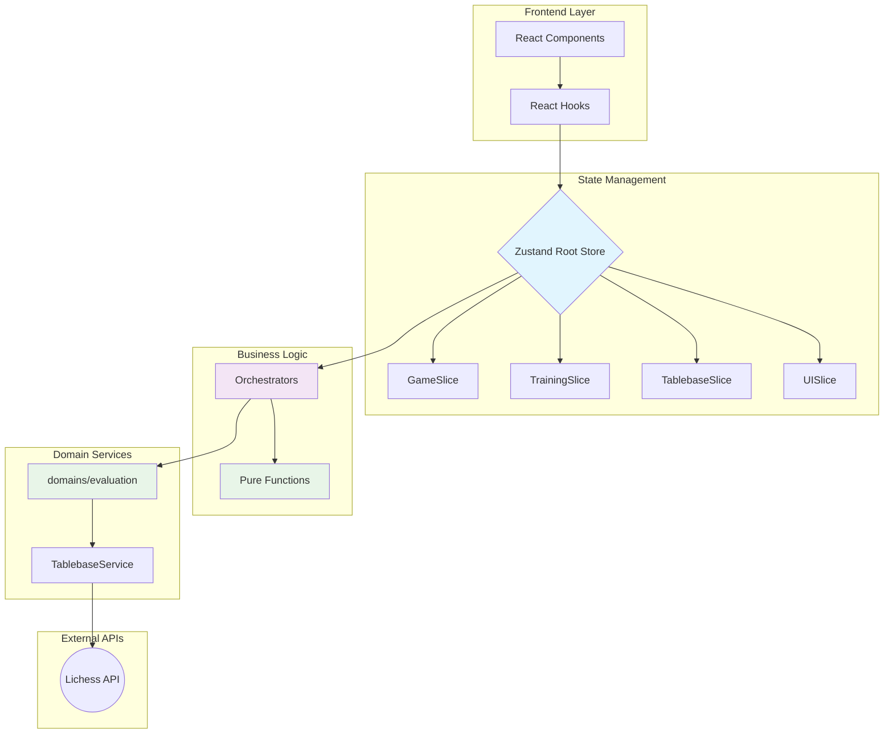

# CORE.md - Chess Endgame Trainer Architecture

## System Overview

React 19 + TypeScript + Zustand. Domain-driven design with reactive state store as Single Source of Truth.

**Verifiziert**: 2025-08-17 - Phase 1 Domain Migration COMPLETE. Evaluation Domain established at `/src/domains/evaluation/`

## Architecture



### Zustand Domain Slices

| Slice              | Purpose                   | Key State                               |
| ------------------ | ------------------------- | --------------------------------------- |
| **GameSlice**      | Chess logic, FEN, history | `position`, `moveHistory`, `gameStatus` |
| **TrainingSlice**  | Training sessions         | `scenarios`, `sessionStatus`            |
| **TablebaseSlice** | Lichess API cache         | `evaluations`, `cache`, `requestStatus` |
| **UISlice**        | UI state management       | `modals`, `toasts`, `isLoading`         |

### Services

- **TablebaseService**: Lichess API with LRU cache, deduplication, Zod validation
- **Pure Functions**: chess-logic.ts stateless functions (replaces legacy ChessService)
- **PlatformService**: Android/iOS platform abstraction (siehe [VISION.md](./VISION.md))

### Orchestrators

Complex operations across slices: `/shared/store/orchestrators/`

**Example: handlePlayerMove** (964 lines, 4 modules - **appropriately complex**)

1. Validates move (GameSlice) → MoveValidator
2. Evaluates quality (TablebaseSlice) → MoveQualityEvaluator
3. Handles promotion (Training/UI) → PawnPromotionHandler
4. Shows feedback (UISlice) → EventBasedMoveDialogManager
5. Schedules opponent (Training) → OpponentTurnHandler

_Multi-model analysis confirmed: NOT over-engineered, but domain-appropriate complexity_

## Code Standards

### Naming

- Components: `PascalCase.tsx`
- Hooks: `useCamelCase.ts`
- Services: `PascalCaseService.ts`
- Constants: `UPPER_CASE`

### Language

- Code/Comments: English
- UI Text: German (`showToast("Ungültiger Zug", "error")`)

### Imports

1. External (`react`, `zustand`)
2. Aliases (`@shared/...`)
3. Types (`import type {...}`)

## Implementation Patterns

### Container/Presentation

```typescript
// Container: Logic via hooks
function BoardContainer() {
  const { position, makeMove } = useGameActions();
  return <BoardPresentation fen={position.fen()} onMove={makeMove} />;
}

// Presentation: Pure UI
function BoardPresentation({ fen, onMove }) {
  return <Chessboard position={fen} onMove={onMove} />;
}
```

### Zustand with Immer

```typescript
// ✅ Clean with Immer
makeMove: move =>
  set(state => {
    state.game.moveHistory.push(move);
  });

// ❌ Avoid manual spreading
makeMove: move =>
  set(state => ({
    ...state,
    game: { ...state.game, moveHistory: [...state.game.moveHistory, move] },
  }));
```

### Optimized Hooks

```typescript
// ✅ Specific hooks prevent re-renders
const { makeMove } = useGameActions(); // Actions only
const { fen } = useGameState(); // State only
const [state, actions] = useGameStore(); // Both (rare)

// ❌ Subscribes to entire slice
const gameStore = useGameStore();
```

## Critical Files (Verifiziert existieren)

```
src/shared/store/rootStore.ts                      # Main store ✓
src/shared/utils/chess-logic.ts                    # Pure chess functions ✓
src/shared/store/orchestrators/handlePlayerMove/   # Move handling ✓
src/shared/store/orchestrators/loadTrainingContext.ts # Training context ✓
src/features/training/events/EventBasedMoveDialogManager.ts # Dialog handling ✓
```

## Architektur-Korrekturen

**NICHT existierende Dateien** (oft falsch referenziert):

- ❌ `ChessService.ts` (MIGRIERT 2025-08-17 - nutze @shared/utils/chess-logic.ts pure functions)
- ❌ `MoveDialogManager.ts` (nutze stattdessen EventBasedMoveDialogManager)
- ❌ `SpacedRepetitionService` (YAGNI cleanup 2025-01-14)
- ❌ `ProgressService` (YAGNI cleanup 2025-01-14)

## Testing Strategy

- **Framework**: Vitest (Jest→Vitest migration completed 2025-01-14)
- **Structure**: `src/tests/unit/`, `src/features/*/`
- **WSL Critical**: `pnpm test file.tsx` (never use `--`)

## Feature Architecture

3 bounded domains with co-located tests:

- `chess-core/`: Game logic, validation
- `tablebase/`: Lichess API integration
- `training/`: Session management

Migration complete - all tests migrated to Vitest.
