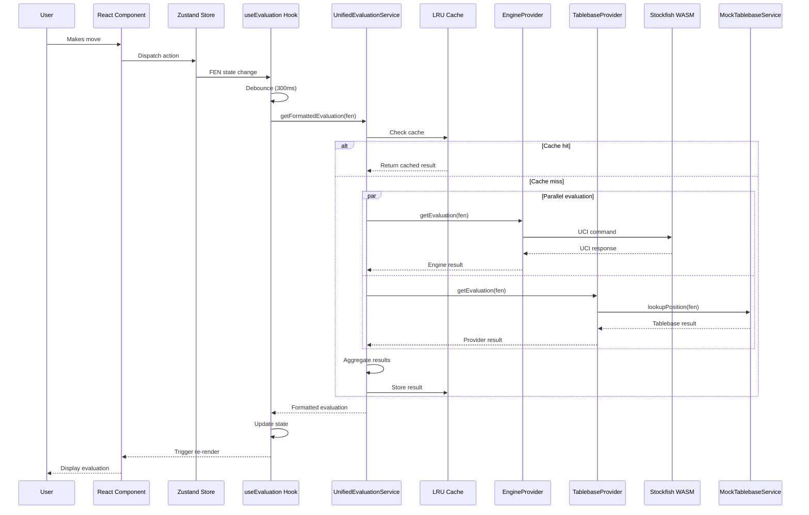

# Critical Data Flow Mappings

**Target**: LLM comprehension for evaluation pipeline understanding
**Environment**: WSL + VS Code + Windows
**Updated**: 2025-07-13

## 🔄 Primary Data Flows

### 1. Position Evaluation Flow



#### Key Files:
- **Entry Point**: `/shared/hooks/useEvaluation.ts:137-180`
- **Unified Service**: `/shared/lib/chess/evaluation/unifiedService.ts:45-75`
- **Engine Provider**: `/shared/lib/chess/evaluation/providerAdapters.ts:15-51`
- **Tablebase Provider**: `/shared/lib/chess/evaluation/providerAdapters.ts:57-91`

### 2. Engine Communication Flow

```
Position Request (FEN)
  ↓
useEvaluation Hook
  ↓ debounced (300ms)
UnifiedEvaluationService.getFormattedEvaluation()
  ↓
EngineProviderAdapter.getEvaluation()
  ↓
Engine.evaluatePositionEnhanced()
  ↓
WorkerManager.sendMessage()
  ↓
Stockfish WASM Worker
  ↓ UCI Protocol
UCI Message (info depth 20 score cp 150 pv e2e4...)
  ↓
UCIParser.parseInfo()
  ↓
Enhanced Evaluation Object
  ↓
Provider Adapter Formatting
  ↓
Unified Service Aggregation
  ↓
Hook State Update
  ↓
Component Re-render
```

#### Key Files:
- **UCI Parser**: `/shared/lib/chess/engine/uciParser.ts:70-120`
- **Worker Manager**: `/shared/lib/chess/engine/workerManager.ts`
- **Engine Singleton**: `/shared/lib/chess/engine/singleton.ts`
- **Message Handler**: `/shared/lib/chess/engine/messageHandler.ts`

### 3. Tablebase Integration Flow

```
Position (FEN with ≤7 pieces)
  ↓
TablebaseProviderAdapter.getEvaluation()
  ↓
TablebaseServiceAdapter.getEvaluation()
  ↓
MockTablebaseService.lookupPosition()
  ↓
Cached Result Check
  ↓ (if miss)
Endgame Pattern Matching
  ↓
TablebaseLookupResult {
  wdl: number,      // -2 to +2
  dtz: number,      // Distance to Zero
  dtm: number,      // Distance to Mate
  category: string  // 'win', 'draw', 'loss'
}
  ↓
TablebaseResult (Provider Format)
  ↓
UnifiedEvaluationService
  ↓
Formatted Display
```

#### Key Files:
- **Service Interface**: `/shared/services/tablebase/ITablebaseService.ts`
- **Mock Implementation**: `/shared/services/tablebase/MockTablebaseService.ts`
- **Service Adapter**: `/shared/services/tablebase/TablebaseServiceAdapter.ts`
- **Provider Adapter**: `/shared/lib/chess/evaluation/providerAdapters.ts:57-91`

### 4. State Management Flow

```
User Interaction
  ↓
Component Event Handler
  ↓
Store Action Dispatch
  ↓
trainingActions.ts Functions:
  ├─ makeMove()
  ├─ navigateToMove()
  ├─ resetGame()
  └─ updateEvaluation()
  ↓
Store State Update (store.ts)
  ↓
Zustand Subscription Notification
  ↓
Component Re-render
  ↓
useEvaluation Hook Trigger
  ↓
New Evaluation Request
```

#### Key Files:
- **Store Definition**: `/shared/store/store.ts`
- **Training Actions**: `/shared/store/trainingActions.ts`
- **Store Config**: `/shared/store/storeConfig.ts`
- **Store Types**: `/shared/store/types.ts`

## 📊 Data Transformation Points

### 1. UCI Protocol → Structured Data

**Input** (UCI string):
```
info depth 20 score cp 150 nodes 1000000 time 5000 pv e2e4 e7e5 g1f3
```

**Output** (UCIEvaluation):
```typescript
{
  score: 150,
  mate: null,
  depth: 20,
  nodes: 1000000,
  time: 5000,
  pv: ['e2e4', 'e7e5', 'g1f3'],
  pvString: 'e2e4 e7e5 g1f3',
  nps: 200000,
  // ... other fields
}
```

**Transform Location**: `/shared/lib/chess/engine/uciParser.ts:70-120`

### 2. Engine Evaluation → Provider Format

**Input** (Enhanced Engine Result):
```typescript
{
  score: 150,
  mate: null,
  depth: 20,
  pv: ['e2e4', 'e7e5']
  // ... UCI fields
}
```

**Output** (EngineEvaluation):
```typescript
{
  score: 150,
  mate: null,
  evaluation: "1.50",  // Formatted display
  depth: 20,
  nodes: 1000000,
  time: 5000,
  pv: ['e2e4', 'e7e5'],
  pvString: 'e2e4 e7e5'
}
```

**Transform Location**: `/shared/lib/chess/evaluation/providerAdapters.ts:26-46`

### 3. Provider Results → Unified Evaluation

**Input** (Multiple Providers):
```typescript
engineResult: EngineEvaluation | null
tablebaseResult: TablebaseResult | null
```

**Output** (EvaluationData):
```typescript
{
  evaluation: 150,
  mateInMoves: undefined,
  tablebase: { wdl: 2, category: 'win' },
  pv: ['e2e4', 'e7e5'],
  depth: 20,
  // ... enhanced UCI data
}
```

**Transform Location**: `/shared/hooks/useEvaluation.ts:170-190`

### 4. Store State → Component Props

**Store State**:
```typescript
{
  currentFen: string,
  moveHistory: Move[],
  evaluationData: EvaluationData | null,
  // ... other state
}
```

**Component Props** (derived):
```typescript
{
  position: Chess instance,
  evaluation: FormattedEvaluation,
  principalVariation: string[],
  // ... computed props
}
```

**Transform Location**: Various component hooks and selectors

## 🎯 Critical Integration Points

### 1. Hook ↔ Service Integration

**File**: `/shared/hooks/useEvaluation.ts:137-180`
```typescript
// Service instantiation
const service = new UnifiedEvaluationService(
  new EngineProviderAdapter(),
  new TablebaseProviderAdapter(),
  new LRUCacheAdapter(cache)
);

// Evaluation request
const formattedEval = await service.getFormattedEvaluation(fen, playerToMove);
const rawEngineEval = await service.getRawEngineEvaluation(fen, playerToMove);
```

### 2. Store ↔ Hook Integration

**File**: `/shared/hooks/useEvaluation.ts:75-95`
```typescript
// FEN extraction from store
const currentFen = useTrainingStore(state => state.currentFen);

// Store update trigger
useEffect(() => {
  if (fen && isEnabled) {
    evaluatePosition(fen);
  }
}, [fen, isEnabled]);
```

### 3. Component ↔ Hook Integration

**File**: Various training components
```typescript
// Hook usage
const { 
  evaluations, 
  lastEvaluation, 
  isEvaluating 
} = useEvaluation({
  fen: currentFen,
  isEnabled: true
});

// Component rendering
{isEvaluating ? <Spinner /> : <EvaluationDisplay evaluation={lastEvaluation} />}
```

## 🔧 Performance Optimization Points

### 1. Debouncing Layer
**Location**: `/shared/hooks/useEvaluation.ts:105-115`
- **Trigger**: User position changes
- **Delay**: 300ms
- **Purpose**: Prevent excessive engine requests

### 2. Caching Layer
**Location**: `/shared/lib/chess/evaluation/unifiedService.ts:30-45`
- **Strategy**: LRU + Chess-aware caching
- **Capacity**: 200 positions
- **Key Format**: `${fen}:${perspective}`

### 3. Worker Management
**Location**: `/shared/lib/chess/engine/workerManager.ts`
- **Pattern**: Single worker instance
- **Lifecycle**: Lazy initialization + cleanup
- **Memory**: ~20MB constraint

## 🛡️ Error Handling Flow

```
Error Occurrence
  ↓
Try-Catch Block
  ↓
Error Classification:
  ├─ AbortError → Ignore (cancel operation)
  ├─ NetworkError → Log + Fallback
  └─ Other → Log + User notification
  ↓
ErrorService.logError(context, error)
  ↓
Graceful Fallback:
  ├─ Engine Error → Return null
  ├─ Tablebase Error → Return null
  └─ Cache Error → Continue without cache
  ↓
User Experience Preservation
```

### Error Handling Locations:
- **Engine Errors**: `/shared/lib/chess/evaluation/providerAdapters.ts:47-49`
- **Tablebase Errors**: `/shared/lib/chess/evaluation/providerAdapters.ts:78-81`
- **Hook Errors**: `/shared/hooks/useEvaluation.ts:195-205`

---

**Next**: Review [patterns/EVALUATION_PIPELINE.md](./patterns/EVALUATION_PIPELINE.md) for implementation patterns.