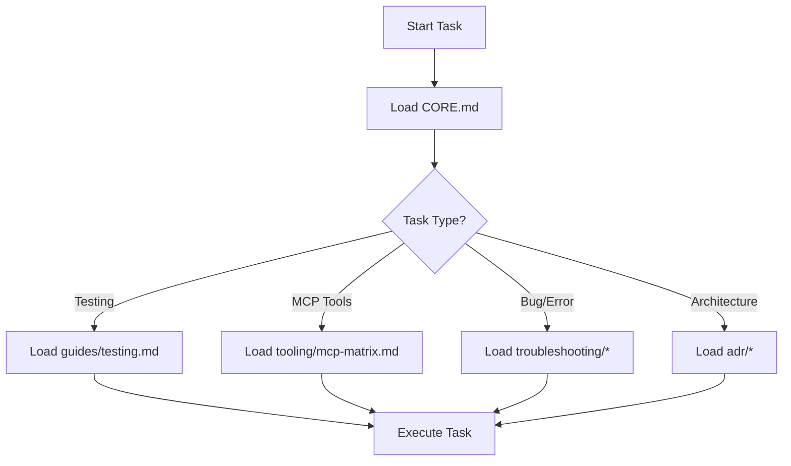

# Documentation Hub

<!-- nav: CLAUDE.md | tags: [docs, navigation] | updated: 2025-01-14 -->

## 🎯 Navigation Guide for LLM

This is the central navigation hub. Load specific docs based on your task.

## 📁 Documentation Structure

### Core (ALWAYS LOAD FIRST)
- [`CORE.md`](CORE.md) - **Architecture, state management, patterns**

### Guides
- [`guides/testing.md`](guides/testing.md) - Vitest setup, WSL2 test commands
- [`guides/wsl2.md`](guides/wsl2.md) - WSL2 environment troubleshooting
- [`guides/FIREBASE_SETUP.md`](guides/FIREBASE_SETUP.md) - Firebase configuration

### MCP Tools
- [`tooling/mcp-matrix.md`](tooling/mcp-matrix.md) - **Tool selection decision matrix**
- [`tooling/mcp-overview.md`](tooling/mcp-overview.md) - Available MCP servers
- [`tooling/mcp-zen.md`](tooling/mcp-zen.md) - AI workflow tools (debug, refactor, etc.)
- [`tooling/mcp-playwright.md`](tooling/mcp-playwright.md) - Browser automation
- [`tooling/mcp-claude-context.md`](tooling/mcp-claude-context.md) - Semantic code search
- [`tooling/mcp-organization.md`](tooling/mcp-organization.md) - MCP server structure

### Services & Components
- [`shared/README.md`](shared/README.md) - Shared module architecture
- [`services/Logger.md`](services/Logger.md) - Logging service
- [`orchestrators/handlePlayerMove/README.md`](orchestrators/handlePlayerMove/README.md) - Move handling

### Architecture Decisions
- [`adr/001-extract-cache-manager.md`](adr/001-extract-cache-manager.md) - Cache extraction

### Troubleshooting
- [`troubleshooting/vitest-async-patterns.md`](troubleshooting/vitest-async-patterns.md) - Async test patterns

### Archive (Historical Reference)
- [`archive/`](archive/) - Deprecated docs (DO NOT use for new work)

## 🤖 LLM Loading Strategy

## 📋 Quick Reference

### By Task Type

| Task | Load These Docs |
|------|----------------|
| **Any Development** | `CORE.md` |
| **Writing Tests** | `CORE.md` → `guides/testing.md` |
| **Using MCP Tools** | `CORE.md` → `tooling/mcp-matrix.md` |
| **Debugging** | `CORE.md` → `tooling/mcp-zen.md` |
| **Code Search** | `tooling/mcp-claude-context.md` |
| **Browser Testing** | `tooling/mcp-playwright.md` |
| **WSL2 Issues** | `guides/wsl2.md` |
| **Architecture Review** | `CORE.md` → `adr/*` |

### By Codebase Area

| Area | Documentation |
|------|--------------|
| **State Management** | `CORE.md` (Zustand section) |
| **Chess Logic** | `CORE.md` → `services/ChessService` |
| **Move Handling** | `orchestrators/handlePlayerMove/README.md` |
| **Tablebase** | `shared/services/tablebase/README.md` |
| **Testing** | `guides/testing.md` |

## 🚀 Context7 Integration

For latest framework documentation, add to your prompts:
- `"use context7 for React 19 hooks"`
- `"use context7 for Next.js 15 app router"`
- `"use context7 for Zustand state management"`

## 📝 Documentation Principles

1. **Progressive Disclosure** - Load only what's needed
2. **Task-Oriented** - Docs organized by what you're doing
3. **Cross-Referenced** - Clear links between related docs
4. **LLM-Optimized** - Structured for efficient parsing

## 🔄 Update Guidelines

When updating docs:
1. Keep this README in sync with new files
2. Update the matrix in `tooling/mcp-matrix.md` for new tools
3. Add navigation breadcrumbs to new docs
4. Tag with relevant keywords for search
