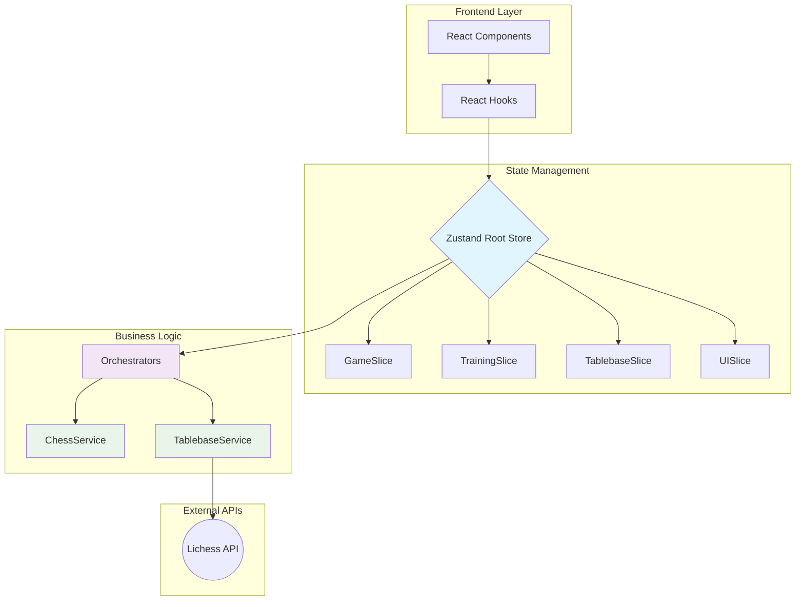

# SYSTEM_GUIDE.md

<!-- nav: docs/README#architecture | tags: [architecture, system] | updated: 2025-08-12 -->

## 1. System Overview

Chess Endgame Trainer built with React, TypeScript, and Zustand. Domain-driven design with central reactive state store as Single Source of Truth.

## 2. Architecture



### Zustand Domain Slices

Global state divided into domain-specific slices:

- **`GameSlice`**: Chess game logic, FEN positions, move history
- **`TrainingSlice`**: Training scenarios, user progress, session status
- **`TablebaseSlice`**: Lichess tablebase results, cache, status
- **`UISlice`**: Modals, toasts, UI element states

### Services

Services encapsulate external dependencies:

- **`TablebaseService`**: Lichess API calls with LRU cache, request deduplication, Zod validation
- **`ChessService`**: Wrapper for chess.js (legacy singleton - prefer GameSlice interaction)

### Orchestrators

Complex operations spanning multiple slices:

- **Location**: `/shared/store/orchestrators/`
- **Example**: `handlePlayerMove` coordinates move validation (GameSlice), training progress (TrainingSlice), UI feedback (UISlice)
- **Deep dive**: → [MOVE_HANDLING_ARCHITECTURE.md](./MOVE_HANDLING_ARCHITECTURE.md)

## 3. Code Standards

### Naming Conventions

- **Components**: `PascalCase.tsx` (e.g., `TrainingBoard.tsx`)
- **Hooks**: `useCamelCase.ts` (e.g., `useTrainingSession.ts`)
- **Services**: `PascalCaseService.ts` (e.g., `TablebaseService.ts`)
- **Utils/Types**: `camelCase.ts` / `types.ts`
- **Constants**: `UPPER_CASE` (e.g., `CACHE_SIZE`)

### Import Order

1. External dependencies (`react`, `zustand`)
2. Internal aliases (`@shared/...`)
3. Relative imports (`./Component`)
4. Type imports (`import type {...}`)

### Language

- **Code & Comments**: English
- **User-visible text**: German

```typescript
// User-facing errors, toasts, UI text must be German
showToast("Ungültiger Zug", "error");
```

## 4. Implementation Patterns

### React: Container/Presentation Pattern

Separate logic (Container) from pure display (Presentation):

**DO: Separate responsibilities**

```typescript
// Container: Manages state and logic via hooks
function TrainingBoardContainer() {
  const { position, makeMove } = useGameActions();
  const { lastEvaluation } = useEvaluation({ fen: position.fen() });

  return (
    <TrainingBoardPresentation
      fen={position.fen()}
      evaluation={lastEvaluation}
      onMove={makeMove}
    />
  );
}

// Presentation: Only renders UI based on props
function TrainingBoardPresentation({ fen, evaluation, onMove }) {
  return (
    <div>
      <Chessboard position={fen} onMove={onMove} />
      <EvaluationCard evaluation={evaluation} />
    </div>
  );
}
```

### Zustand: State Updates with Immer

Use Immer's mutating syntax for clean, immutable updates:

**DO: Use Immer for state updates**

```typescript
// ✅ Clean and safe with Immer
makeMove: (move) => set((state) => {
  state.game.moveHistory.push(move);
}),
```

**DON'T: Manually spread state**

```typescript
// ❌ Cumbersome and error-prone
makeMove: (move) => set((state) => ({
  ...state,
  game: {
    ...state.game,
    moveHistory: [...state.game.moveHistory, move],
  }
})),
```

### Zustand: Optimized Slice Hooks

Access store via performant, specialized hooks to avoid unnecessary re-renders:

**DO: Use most specific hook needed**

```typescript
// ✅ For components needing only actions (no re-render on state change)
const { makeMove } = useGameActions();

// ✅ For components only reading reactive state
const { fen } = useGameState();

// ✅ For components needing both (rarer)
const [state, actions] = useGameStore();
```

**DON'T: Subscribe to entire store slice**

```typescript
// ❌ Re-renders on ANY state change in slice
const gameStore = useGameStore();
```

### Zustand: Avoid "God Store"

**DO: Keep slices focused on single domain**

```typescript
// ✅ Good: Slices separated by domain
// /shared/store/slices/gameSlice.ts
// /shared/store/slices/uiSlice.ts
```

**DON'T: Mix unrelated state in huge store**

```typescript
// ❌ Bad: Mixing UI, user, and game state leads to maintenance nightmares
create((set) => ({
  user: null,
  isSidebarOpen: false,
  currentFen: "...",
  // ...50 more properties
}));
```
