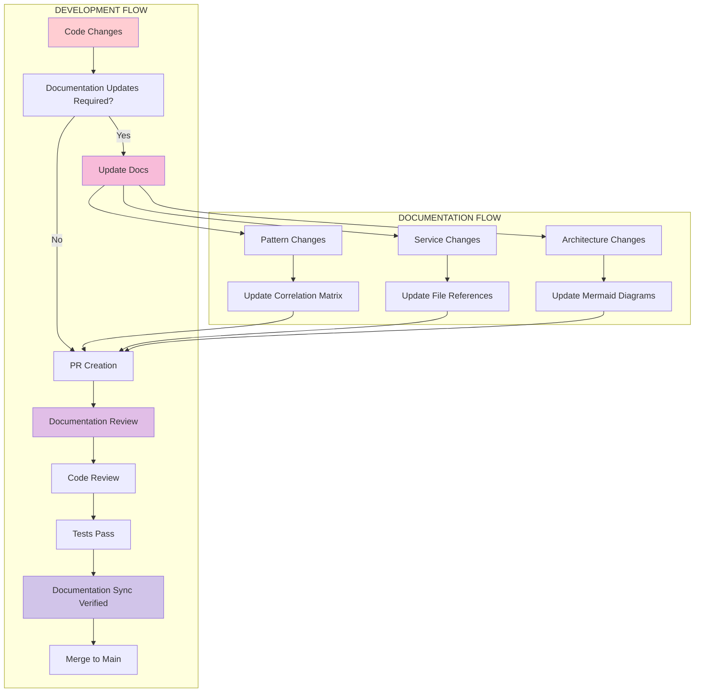

# Documentation Workflow & PR Integration

**Target**: LLM comprehension for documentation maintenance workflows
**Environment**: WSL + VS Code + Windows
**Updated**: 2025-07-13

## 🔄 Documentation Lifecycle

### Integration with Development Workflow



## 📋 Documentation Update Matrix

### When Code Changes Require Documentation Updates

| Change Type | Documentation Files to Update | Priority | Automation Possible |
|-------------|-------------------------------|----------|-------------------|
| **New React Component** | `docs/patterns/REACT_PATTERNS.md` | High | ❌ Manual |
| **New Store Action** | `docs/patterns/ZUSTAND_PATTERNS.md` | High | ❌ Manual |
| **Service Interface Change** | Service-specific README.md | Critical | 🔶 Partial |
| **API Endpoint Change** | `docs/API.md` | Critical | ✅ Auto-gen |
| **Architecture Change** | `docs/ARCHITECTURE.md` | Critical | ❌ Manual |
| **Data Flow Change** | `docs/DATA_FLOWS.md` | High | ❌ Manual |
| **New Pattern Implementation** | Relevant pattern docs | High | ❌ Manual |
| **File Path Changes** | All affected documentation | Critical | 🔶 Scriptable |
| **Line Number Changes** | Code correlation updates | Medium | ✅ Scriptable |

### Change Detection Triggers

**File**: `.github/workflows/docs-sync-check.yml`
```yaml
name: Documentation Sync Check

on:
  pull_request:
    types: [opened, synchronize]

jobs:
  check-docs-sync:
    runs-on: ubuntu-latest
    steps:
      - uses: actions/checkout@v4
        with:
          fetch-depth: 0
      
      - name: Check for documentation updates
        run: |
          # Files that require documentation updates
          CHANGED_FILES=$(git diff --name-only origin/main...HEAD)
          
          # Critical paths that always require doc updates
          if echo "$CHANGED_FILES" | grep -E "(shared/lib|shared/services|shared/store)" ; then
            echo "::error::Core architecture files changed - documentation update required"
            echo "Please update relevant documentation in /docs"
            exit 1
          fi
          
          # Check if patterns changed without doc updates
          if echo "$CHANGED_FILES" | grep -E "(components|hooks)" && ! echo "$CHANGED_FILES" | grep "docs/" ; then
            echo "::warning::React/Hook patterns may have changed - consider updating docs/patterns/"
          fi
```

## 🔧 Documentation Maintenance Checklist

### Pre-Commit Checklist

**File**: `/docs/checklists/PRE_COMMIT_DOCS.md`
```markdown
## 📋 Pre-Commit Documentation Checklist

### Code Changes Analysis
- [ ] **New components created?** → Update `docs/patterns/REACT_PATTERNS.md`
- [ ] **Store actions modified?** → Update `docs/patterns/ZUSTAND_PATTERNS.md`  
- [ ] **Service interfaces changed?** → Update service README.md
- [ ] **File paths changed?** → Update all documentation references
- [ ] **New data flows introduced?** → Update `docs/DATA_FLOWS.md`

### File Reference Verification
- [ ] **Line numbers accurate?** → Run line reference update script
- [ ] **File paths absolute?** → Verify all paths start with `/shared/`
- [ ] **Code examples current?** → Test code examples still compile
- [ ] **Mermaid diagrams updated?** → Verify diagrams match current architecture

### Pattern Documentation
- [ ] **New patterns documented?** → Add to appropriate pattern files
- [ ] **Anti-patterns identified?** → Add to anti-pattern sections
- [ ] **Performance implications noted?** → Document in relevant sections

### Cross-Reference Validation
- [ ] **Internal links work?** → Test all `[text](./file.md)` links
- [ ] **File references exist?** → Verify all referenced files exist
- [ ] **Code correlation accurate?** → Verify file:line references are correct
```

### Post-Merge Checklist

**File**: `/docs/checklists/POST_MERGE_DOCS.md`
```markdown
## 📋 Post-Merge Documentation Checklist

### Documentation Drift Prevention
- [ ] **Documentation builds successfully** → Verify no broken links
- [ ] **Code examples still valid** → Test critical code examples
- [ ] **Architecture diagrams current** → Review Mermaid diagrams
- [ ] **File references accurate** → Run reference validation script

### Maintenance Tasks
- [ ] **Dead links removed** → Clean up obsolete references  
- [ ] **Outdated examples updated** → Refresh stale code examples
- [ ] **New patterns captured** → Document emerging patterns
- [ ] **Performance metrics updated** → Update performance characteristics
```

## 🤖 Automation Scripts

### Line Reference Update Script

**File**: `/scripts/update-doc-references.js`
```javascript
#!/usr/bin/env node
/**
 * Updates line number references in documentation files
 * Usage: node scripts/update-doc-references.js
 */

const fs = require('fs');
const path = require('path');
const glob = require('glob');

// Pattern to match file:line references
const FILE_LINE_PATTERN = /(`[^`]*\.tsx?:[0-9]+-[0-9]+`)/g;

function updateDocumentationReferences() {
  const docFiles = glob.sync('docs/**/*.md');
  
  docFiles.forEach(docFile => {
    const content = fs.readFileSync(docFile, 'utf8');
    let updated = false;
    
    const newContent = content.replace(FILE_LINE_PATTERN, (match, reference) => {
      // Extract file path and line numbers
      const [filePath, lineRange] = reference.slice(1, -1).split(':');
      const fullPath = path.resolve(filePath);
      
      if (!fs.existsSync(fullPath)) {
        console.warn(`File not found: ${filePath}`);
        return match;
      }
      
      // Validate line numbers against actual file
      const fileContent = fs.readFileSync(fullPath, 'utf8');
      const lineCount = fileContent.split('\n').length;
      const [startLine] = lineRange.split('-').map(Number);
      
      if (startLine > lineCount) {
        console.warn(`Line ${startLine} exceeds file length ${lineCount} in ${filePath}`);
        updated = true;
        return `\`${filePath}:1-${Math.min(50, lineCount)}\``;
      }
      
      return match;
    });
    
    if (updated) {
      fs.writeFileSync(docFile, newContent);
      console.log(`Updated references in ${docFile}`);
    }
  });
}

updateDocumentationReferences();
```

### Documentation Correlation Validator

**File**: `/scripts/validate-doc-correlation.js`
```javascript
#!/usr/bin/env node
/**
 * Validates that code examples in documentation match actual implementation
 * Usage: node scripts/validate-doc-correlation.js
 */

const fs = require('fs');
const path = require('path');
const glob = require('glob');

function validateCodeCorrelation() {
  const docFiles = glob.sync('docs/**/*.md');
  const errors = [];
  
  docFiles.forEach(docFile => {
    const content = fs.readFileSync(docFile, 'utf8');
    
    // Find all code blocks with file references
    const codeBlockPattern = /```typescript\n\/\/ File: (.*?):(\d+)-(\d+)\n(.*?)\n```/gs;
    let match;
    
    while ((match = codeBlockPattern.exec(content)) !== null) {
      const [, filePath, startLine, endLine, codeExample] = match;
      const fullPath = path.resolve(filePath);
      
      if (!fs.existsSync(fullPath)) {
        errors.push(`File not found: ${filePath} (referenced in ${docFile})`);
        continue;
      }
      
      // Read actual file content
      const fileContent = fs.readFileSync(fullPath, 'utf8');
      const lines = fileContent.split('\n');
      const actualCode = lines.slice(parseInt(startLine) - 1, parseInt(endLine)).join('\n');
      
      // Compare code examples (simplified comparison)
      const normalizedExample = codeExample.replace(/\s+/g, ' ').trim();
      const normalizedActual = actualCode.replace(/\s+/g, ' ').trim();
      
      if (!normalizedActual.includes(normalizedExample.substring(0, 100))) {
        errors.push(`Code example mismatch in ${docFile} for ${filePath}:${startLine}-${endLine}`);
      }
    }
  });
  
  if (errors.length > 0) {
    console.error('Documentation correlation errors found:');
    errors.forEach(error => console.error(`- ${error}`));
    process.exit(1);
  } else {
    console.log('All documentation correlations validated successfully');
  }
}

validateCodeCorrelation();
```

## 📊 Documentation Health Monitoring

### Metrics to Track

**File**: `/scripts/doc-health-metrics.js`
```javascript
#!/usr/bin/env node
/**
 * Generates documentation health metrics
 * Usage: node scripts/doc-health-metrics.js
 */

function generateHealthMetrics() {
  const metrics = {
    // Coverage metrics
    totalCodeFiles: 0,
    documentedFiles: 0,
    coveragePercentage: 0,
    
    // Reference health
    totalReferences: 0,
    brokenReferences: 0,
    outdatedReferences: 0,
    
    // Content freshness
    lastUpdated: {},
    staleDocuments: [],
    
    // Pattern documentation
    documnetedPatterns: 0,
    undocumentedPatterns: 0,
    
    // Anti-pattern coverage
    antiPatternCount: 0,
    examplesWithAntiPatterns: 0
  };
  
  // Implementation would analyze actual files
  console.log('Documentation Health Report:');
  console.log(JSON.stringify(metrics, null, 2));
}

generateHealthMetrics();
```

## 🎯 Critical Documentation Principles

### 1. Code-First Documentation
- **Principle**: Documentation follows code, never leads
- **Implementation**: All examples must reference actual implementation
- **Validation**: Automated correlation checking

### 2. Single Source of Truth
- **Principle**: Each pattern documented in exactly one place
- **Implementation**: Clear ownership matrix for documentation sections
- **Validation**: No duplicate pattern explanations

### 3. LLM-Optimized Structure
- **Principle**: Documentation optimized for LLM consumption
- **Implementation**: File paths, line numbers, explicit examples
- **Validation**: Regular LLM-assisted validation of clarity

### 4. Minimal Maintenance Overhead
- **Principle**: Documentation updates integrated into development flow
- **Implementation**: Automated checks and scriptable updates
- **Validation**: Documentation debt tracked and resolved

## 🚨 Documentation Debt Management

### Debt Detection
```bash
# Script to detect documentation debt
#!/bin/bash

echo "Checking for documentation debt..."

# Check for TODO/FIXME in docs
grep -r "TODO\|FIXME" docs/ && echo "Found documentation TODOs"

# Check for outdated file references
find docs/ -name "*.md" -exec grep -l "Line.*:" {} \; | while read file; do
  echo "Checking file references in $file"
  # Validate references (simplified)
done

# Check for broken internal links
find docs/ -name "*.md" -exec grep -l "\](./" {} \; | while read file; do
  echo "Checking internal links in $file"
done
```

### Debt Resolution Workflow
1. **Detection**: Automated scripts identify issues
2. **Prioritization**: Critical path documentation first
3. **Assignment**: Clear ownership for resolution
4. **Verification**: Automated validation post-fix
5. **Prevention**: Process improvements to prevent recurrence

---

**Next**: Review documentation maintenance checklists and automation scripts.