# Training Session Lifecycle

**Purpose**: Complete training session flow from position selection to completion
**Last Updated**: 2025-08-16

## 🎯 Overview

This document traces the complete lifecycle of a chess training session, from initial position loading through move handling to session completion. It covers the coordination between multiple orchestrators and state management across all slices.

## 📊 Complete Training Session Flow

```mermaid
graph TD
    A["👤 User Selects Position<br/>EndgamePosition"] --> B[loadTrainingContext Orchestrator]

    subgraph "🔍 Validation & Setup Phase"
        B --> C{Valid FEN?}
        C -->|❌ Invalid| D["🚨 Error Toast<br/>'Ungültige FEN-Position'"]
        C -->|✅ Valid| E[Initialize ChessService]
        E --> F["🧹 Reset All Slices<br/>Game, Tablebase, UI"]
    end

    subgraph "🏗️ Position Setup Phase"
        F --> G["📋 Create TrainingPosition<br/>+ colorToTrain, targetOutcome"]
        G --> H["🔄 Load Navigation (Parallel)<br/>getNextPosition(), getPreviousPosition()"]
        H --> I["📍 Set Current Position<br/>draft.training.currentPosition"]
    end

    subgraph "🎯 Turn Decision Phase"
        I --> J{"👥 Who moves first?<br/>chessService.turn() vs colorToTrain"}
        J -->|Player| K["✋ Player's Turn<br/>isPlayerTurn = true"]
        J -->|Opponent| L["🤖 Opponent's Turn<br/>isPlayerTurn = false"]
    end

    subgraph "👤 Player Move Handling"
        K --> M["⏳ Wait for User Move<br/>Chessboard interaction"]
        M --> N["🎯 handlePlayerMove Orchestrator<br/>User clicks/drags piece"]
        N --> O[MoveValidator]
        O --> P{Valid Move?}
        P -->|❌ Invalid| Q["🚨 Invalid Move Toast"]
        P -->|✅ Valid| R[Execute Move in ChessService]
        Q --> M
    end

    subgraph "📊 Quality Analysis Phase"
        R --> S[MoveQualityEvaluator]
        S --> T["📡 tablebaseService.getTopMoves<br/>Fetch optimal moves"]
        T --> U["🔍 wasMoveBest() Check<br/>Compare played vs optimal"]
        U --> V{Move Optimal?}
        V -->|❌ Suboptimal| W["⚠️ Error Dialog<br/>'Besser wäre Ke7'"]
        V -->|✅ Optimal| X["✅ Move Accepted"]
        W --> Y["👆 User: 'Weiterspielen'<br/>Dialog dismissed"]
    end

    subgraph "🎮 Game State Check"
        X --> Z{Game Over?}
        Y --> Z
        Z -->|✅ Finished| AA["🎉 Training Complete<br/>handleTrainingCompletion()"]
        Z -->|❌ Continue| BB["🔄 Switch Turn<br/>Opponent's move needed"]
    end

    subgraph "🤖 Opponent Move Phase"
        L --> CC["⏱️ OpponentTurnHandler.schedule<br/>500ms delay"]
        BB --> CC
        CC --> DD["📡 tablebaseService.getTopMoves<br/>limit=1, best move"]
        DD --> EE["♛ Execute Best Move<br/>chessService.move(bestMoveSan)"]
        EE --> FF["📄 Update Game State<br/>New FEN, move history"]
        FF --> GG{Game Over?}
        GG -->|✅ Finished| AA
        GG -->|❌ Continue| HH["👤 Back to Player Turn"]
        HH --> M
    end

    subgraph "🎯 Training Completion"
        AA --> II["📊 Update Statistics<br/>Success/failure tracking"]
        II --> JJ["🎊 Success Animation<br/>UI feedback"]
        JJ --> KK["🔄 Ready for Next Position<br/>Navigation available"]
    end

    subgraph "🚨 Error Handling"
        D --> LL["🧹 Reset State<br/>Clean slate for retry"]
        LL --> MM["❌ Session Aborted"]
    end

    subgraph "🛡️ E2E Race Condition Prevention"
        N --> NN{E2E Test Mode?}
        NN -->|✅ Yes| OO["⏱️ Promise.race<br/>handlePlayerMove vs 5s timeout"]
        NN -->|❌ No| PP["🔄 Normal Flow"]
        OO --> QQ["⚠️ E2E Timeout Protection"]
        PP --> O
        QQ --> O
    end

    style A fill:#e3f2fd
    style B fill:#fff3e0
    style N fill:#e8f5e8
    style W fill:#ffebee
    style AA fill:#f3e5f5
    style CC fill:#e3f2fd
    style DD fill:#fff3e0
    style OO fill:#fce4ec
```



## 🔄 State Management Details

### Slice Coordination During Lifecycle

```mermaid
graph LR
    subgraph "Game Slice"
        A1[moveHistory: []]
        A2[currentMoveIndex: -1]
        A3[isGameFinished: false]
    end

    subgraph "Training Slice"
        B1[currentPosition: TrainingPosition]
        B2[isPlayerTurn: boolean]
        B3[isOpponentThinking: boolean]
        B4[evaluationBaseline: null]
    end

    subgraph "UI Slice"
        C1[loading.position: boolean]
        C2[toasts: Toast[]]
        C3[currentModal: Dialog | null]
    end

    subgraph "Tablebase Slice"
        D1[analysisStatus: 'idle']
        D2[evaluations: []]
        D3[currentEvaluation: undefined]
    end
```

### Critical State Transitions

1. **Position Loading**:

   ```typescript
   // Before: Fresh state
   game.moveHistory = []
   training.currentPosition = null

   // After: Ready state
   game.moveHistory = [initial moves if any]
   training.currentPosition = TrainingPosition
   training.isPlayerTurn = calculated from turn
   ```

2. **Move Execution**:

   ```typescript
   // Player move
   training.isPlayerTurn = true → false
   training.isOpponentThinking = false → true (if error dialog)

   // Opponent move
   training.isOpponentThinking = true → false
   training.isPlayerTurn = false → true
   ```

3. **Error Recovery**:
   ```typescript
   // After dialog dismissal
   training.isOpponentThinking = false → true (scheduling)
   ui.currentModal = errorDialog → null
   ```

## 🛡️ Race Condition Prevention

### E2E Test Protection


### OpponentTurnHandler Cancellation


## 🔧 Configuration & Timing

### Orchestrator Delays

- **Opponent Turn Delay**: 500ms (natural game feel)
- **E2E Timeout**: 5000ms (prevent hanging tests)
- **Toast Duration**: 2000ms (success), 5000ms (error)
- **Navigation Loading**: Background (non-blocking)

### API Integration Points

- **Position Validation**: Chess.js library
- **Move Quality**: Lichess Tablebase API (3 moves)
- **Opponent Moves**: Lichess Tablebase API (1 move)
- **Navigation**: ServerPositionService (next/prev)

## 🧪 Testing Considerations

### Critical Test Scenarios

1. **Invalid FEN Handling**:

   ```typescript
   // Should reject and show error
   await loadTrainingContext(api, { fen: 'invalid' });
   expect(state.ui.toasts).toContainError('Ungültige FEN-Position');
   ```

2. **Turn Order Validation**:

   ```typescript
   // White to move, training white
   expect(state.training.isPlayerTurn).toBe(true);

   // Black to move, training white
   expect(state.training.isPlayerTurn).toBe(false);
   ```

3. **Error Dialog Flow**:

   ```typescript
   // Bad move → dialog → continue → opponent move
   await handlePlayerMove('Kd7'); // Suboptimal
   expect(state.ui.currentModal).toBeTruthy();
   await clickWeiterspielen();
   expect(state.training.isOpponentThinking).toBe(true);
   ```

4. **Race Condition Prevention**:
   ```typescript
   // Multiple rapid moves should not conflict
   const moves = ['e4', 'd4', 'Nf3'];
   await Promise.all(moves.map(handlePlayerMove));
   // Only first should succeed
   ```

## 🚀 Performance Characteristics

- **Position Load Time**: ~100-300ms (FEN validation + state setup)
- **Move Validation**: <10ms (chess.js synchronous)
- **Quality Analysis**: 50-200ms (tablebase API call)
- **Opponent Response**: 500ms delay + 50-200ms (API + execution)
- **Navigation Load**: Background (~100ms per direction)

## 🎯 Integration with UI Components

### Key Component Interactions

1. **TrainingBoard.tsx**:
   - Triggers `loadTrainingContext` on position change
   - Handles `handlePlayerMove` on piece interaction
   - Displays dialogs from UI slice state

2. **Chessboard.tsx**:
   - `onPieceDrop` → `handlePlayerMove`
   - `onSquareClick` → fallback move method
   - Position updates via `fen` prop from game slice

3. **Dialog Components**:
   - Error dialogs: `EventBasedMoveDialogManager`
   - Success dialogs: Direct UI slice updates
   - Promotion dialogs: Chessboard component integration

## 🎓 Learning Notes

**For LLMs**: This diagram should be referenced when answering questions about:

- "How does training session initialization work?"
- "What happens when a user selects a position?"
- "Why isn't my opponent moving after an error dialog?"
- "How are race conditions prevented in E2E tests?"
- "What's the flow from position selection to completion?"

The key insight is that training sessions involve **4 orchestrated phases**:

1. **Setup Phase**: Validation, state reset, position loading
2. **Game Phase**: Move handling, quality analysis, turn management
3. **Completion Phase**: Statistics, animations, navigation
4. **Error Phase**: Recovery, cleanup, retry preparation
