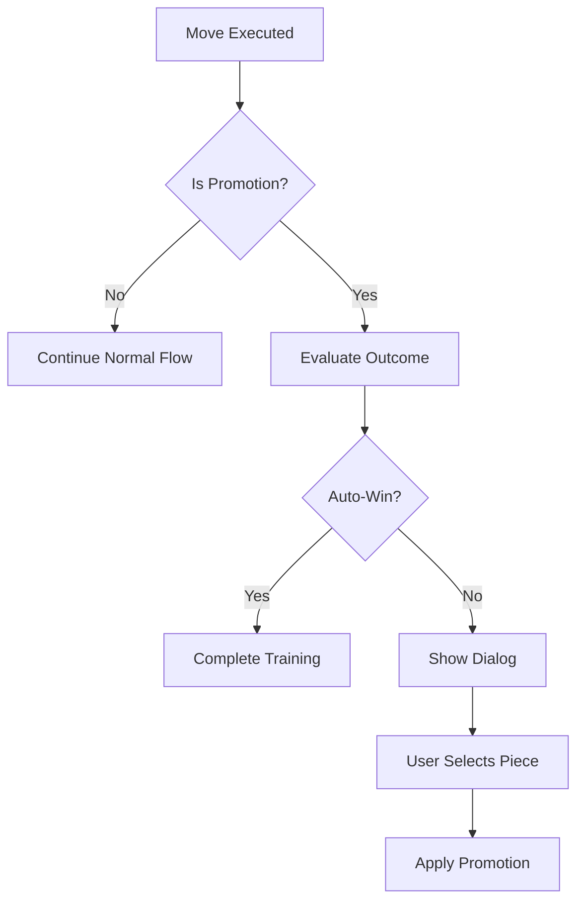

# PawnPromotionHandler Module

## Purpose

Manages pawn promotion detection, evaluation, and handling in chess endgame training, including auto-win scenarios and UI integration.

## Core Functionality

### Promotion Detection

- Uses chess.js flags and properties
- Validates promotion squares (8th rank for white, 1st for black)
- Checks for valid promotion pieces (Q, R, N, B)

### Auto-Win Evaluation

- Evaluates promotion outcomes using tablebase
- Detects immediate wins (mate or winning position)
- Automatically completes training on winning promotions

### UI Integration

- Provides promotion choice dialog (currently auto-promotes to Queen)
- German localized messages
- Future extensibility for piece selection UI

## Data Structures

### PromotionInfo

```typescript
{
  isPromotion: boolean;
  promotionPiece?: "q" | "r" | "n" | "b";
  from?: string;
  to?: string;
  isAutoWin?: boolean;
  moveDescription?: string;
}
```

### PromotionChoice

```typescript
{
  piece: 'q' | 'r' | 'n' | 'b';
  label: string; // German label
  description: string; // German description
}
```

## Key Methods

### checkPromotion()

Determines if a move involves pawn promotion.

**Parameters:**

- `validatedMove`: The move to check

**Returns:**

- `PromotionInfo` object with promotion details

### evaluatePromotionOutcome()

Evaluates if promotion leads to auto-win.

**Parameters:**

- `fenAfter`: Position after promotion
- `playerColor`: Color of promoting player

**Returns:**

- `boolean` indicating auto-win status

### handleAutoWin()

Completes training when promotion wins.

**Parameters:**

- `api`: Store API
- `promotionInfo`: Promotion details

**Effects:**

- Shows success toast
- Completes training session
- Updates statistics

### showPromotionDialog()

Displays promotion choice UI (placeholder).

**Parameters:**

- `api`: Store API
- `promotionInfo`: Promotion details

**Current Implementation:**

- Auto-promotes to Queen
- TODO: Implement actual UI dialog

## Promotion Pieces

### Available Choices

1. **Queen (Dame)**: Most powerful piece
2. **Rook (Turm)**: Straight line movement
3. **Bishop (Läufer)**: Diagonal movement
4. **Knight (Springer)**: L-shaped jumps

### German Localization

```typescript
PROMOTION_CHOICES = [
  { piece: 'q', label: 'Dame', description: '...' },
  { piece: 'r', label: 'Turm', description: '...' },
  { piece: 'n', label: 'Springer', description: '...' },
  { piece: 'b', label: 'Läufer', description: '...' },
];
```

## Integration Flow



## Tablebase Integration

### WDL Evaluation

- Fetches position evaluation after promotion
- Converts to player perspective
- Checks for winning categories (mate, win)

### Category Analysis

- "mate": Immediate checkmate
- "win": Winning position
- Other: Continue training

## Error Handling

### Graceful Degradation

- If tablebase unavailable: Assume not auto-win
- If evaluation fails: Continue normal flow
- Logs errors for debugging

### Validation

- Ensures promotion is legal
- Validates piece selection
- Checks position integrity

## Future Enhancements

### UI Implementation

The `showPromotionDialog` method currently auto-promotes to Queen. Future implementation should:

1. Display modal with 4 piece options
2. Wait for user selection
3. Apply selected promotion
4. Continue game flow

### Advanced Features

- Under-promotion hints
- Educational explanations
- Promotion statistics tracking
- Puzzle-specific promotion requirements

## Testing Strategies

### Unit Tests

- Promotion detection logic
- Auto-win evaluation
- Message generation

### Integration Tests

- Full promotion flow
- Tablebase integration
- Training completion

### E2E Tests

- User interaction flow
- Dialog display and selection
- Statistics updates
