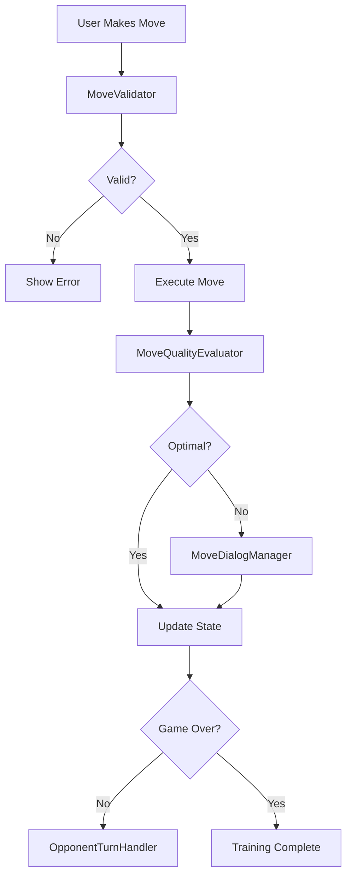

# handlePlayerMove Orchestrator

## Overview

The `handlePlayerMove` orchestrator coordinates all aspects of player move execution in the chess training system. It manages move validation, quality evaluation, pawn promotion, dialogs, and opponent responses.

## Architecture

The orchestrator follows a modular design with specialized handlers:

```
handlePlayerMove/
├── index.ts                 # Main orchestrator entry point
├── MoveValidator.ts         # Move validation logic
├── MoveQualityEvaluator.ts  # Tablebase quality analysis
├── PawnPromotionHandler.ts  # Pawn promotion detection
├── MoveDialogManager.ts     # Dialog interactions
├── OpponentTurnHandler.ts   # Opponent move scheduling
├── move.completion.ts       # Training completion logic
└── move.types.ts           # TypeScript type definitions
```

## Core Flow



## Module Responsibilities

### MoveValidator

- Validates chess moves against game rules
- Checks for legal positions
- Handles special moves (castling, en passant)

### MoveQualityEvaluator

- Compares moves against tablebase recommendations
- Evaluates WDL (Win/Draw/Loss) changes
- Determines if error dialog should be shown
- Tracks move optimality for statistics

### PawnPromotionHandler

- Detects pawn promotion scenarios
- Manages promotion piece selection
- Handles UI interactions for promotion

### MoveDialogManager

- Coordinates error dialogs
- Manages promotion dialogs
- Handles user confirmations
- Provides feedback for suboptimal moves

### OpponentTurnHandler

- Schedules opponent moves with appropriate delays
- Fetches optimal moves from tablebase
- Prevents race conditions during undo/redo
- Manages opponent thinking state

## Key Features

### Race Condition Prevention

The orchestrator implements multiple safeguards against race conditions:

- Cancellation tokens for opponent moves
- State validation before execution
- Atomic state updates using Immer

### Performance Optimizations

- Parallel API calls for evaluations
- Request deduplication
- Smart caching of tablebase results
- Debounced state updates

### Error Resilience

- Graceful degradation when tablebase unavailable
- Fallback strategies for network failures
- Comprehensive error logging
- User-friendly error messages

## Usage

```typescript
import { handlePlayerMove } from "@shared/store/orchestrators/handlePlayerMove";

// Execute a player move
const success = await handlePlayerMove(storeApi, {
  from: "e2",
  to: "e4",
  promotion: "q", // Optional, for pawn promotion
});

// Cancel pending opponent move (e.g., during undo)
import { cancelScheduledOpponentTurn } from "@shared/store/orchestrators/handlePlayerMove";
cancelScheduledOpponentTurn();
```

## Configuration

### Delays and Timeouts

- `OPPONENT_TURN_DELAY`: 500ms (natural game feel)
- `PROMOTION_DIALOG_TIMEOUT`: None (waits for user)
- `ERROR_DIALOG_TIMEOUT`: None (waits for user)

### Tablebase Settings

- `TOP_MOVES_LIMIT`: 3 (for quality comparison)
- `MAX_RETRIES`: 3 (for API failures)
- `CACHE_TTL`: 5 minutes

## Testing

Each module has comprehensive unit tests:

- `MoveValidator.test.ts`
- `MoveQualityEvaluator.test.ts`
- `PawnPromotionHandler.test.ts`
- `MoveDialogManager.test.ts`
- `OpponentTurnHandler.test.ts`

Integration tests cover the full orchestration flow.

## Future Improvements

1. **Event-Based Architecture**: Replace direct coupling with event bus
2. **Strategy Pattern**: For different training modes
3. **Command Pattern**: For undo/redo support
4. **Observer Pattern**: For state change notifications
