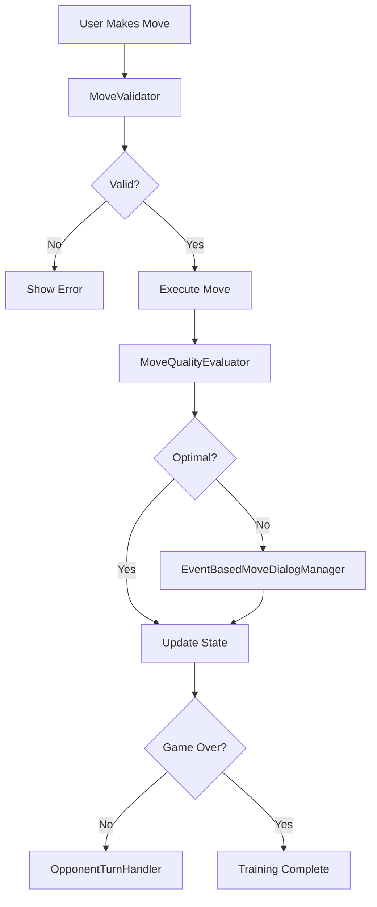

# handlePlayerMove Orchestrator

## Overview

The `handlePlayerMove` orchestrator coordinates all aspects of player move execution in the chess training system. It manages move validation, quality evaluation, pawn promotion, dialogs, and opponent responses.

## Architecture

The orchestrator follows a modular design with specialized handlers:

```
handlePlayerMove/
├── index.ts                 # Main orchestrator entry point
├── MoveValidator.ts         # Move validation logic
├── MoveQualityEvaluator.ts  # Tablebase quality analysis
├── PawnPromotionHandler.ts  # Pawn promotion detection
├── OpponentTurnHandler.ts   # Opponent move scheduling
├── move.completion.ts       # Training completion logic
└── move.types.ts           # TypeScript type definitions

External Dependencies:
└── features/training/events/
    └── EventBasedMoveDialogManager.ts  # Dialog interactions (imported)
```

## Core Flow



## Module Responsibilities

### MoveValidator

- Validates chess moves against game rules
- Checks for legal positions
- Handles special moves (castling, en passant)

### MoveQualityEvaluator

- Compares moves against tablebase recommendations
- Evaluates WDL (Win/Draw/Loss) changes
- Determines if error dialog should be shown
- Tracks move optimality for statistics

### PawnPromotionHandler

- Detects pawn promotion scenarios
- Manages promotion piece selection
- Handles UI interactions for promotion

### EventBasedMoveDialogManager

- Event-driven dialog coordination
- Manages error dialogs for suboptimal moves
- Handles promotion dialogs
- Provides user confirmations
- Imported from `features/training/events/EventBasedMoveDialogManager.ts`

### OpponentTurnHandler

- Schedules opponent moves with appropriate delays
- Fetches optimal moves from tablebase
- Prevents race conditions during undo/redo
- Manages opponent thinking state

## Key Features

### Race Condition Prevention

The orchestrator implements multiple safeguards against race conditions:

- Cancellation tokens for opponent moves
- State validation before execution
- Atomic state updates using Immer

### Performance Optimizations

- Parallel API calls for evaluations
- Request deduplication
- Smart caching of tablebase results
- Debounced state updates

### Error Resilience

- Graceful degradation when tablebase unavailable
- Fallback strategies for network failures
- Comprehensive error logging
- User-friendly error messages

## Usage

```typescript
import { handlePlayerMove } from '@shared/store/orchestrators/handlePlayerMove';

// Execute a player move
const success = await handlePlayerMove(storeApi, {
  from: 'e2',
  to: 'e4',
  promotion: 'q', // Optional, for pawn promotion
});

// Cancel pending opponent move (e.g., during undo)
import { cancelScheduledOpponentTurn } from '@shared/store/orchestrators/handlePlayerMove';
cancelScheduledOpponentTurn();
```

## Configuration

### Delays and Timeouts

- `OPPONENT_TURN_DELAY`: 500ms (natural game feel)
- `PROMOTION_DIALOG_TIMEOUT`: None (waits for user)
- `ERROR_DIALOG_TIMEOUT`: None (waits for user)

### Tablebase Settings

- `TOP_MOVES_LIMIT`: 3 (for quality comparison)
- `MAX_RETRIES`: 3 (for API failures)
- `CACHE_TTL`: 5 minutes

## Testing

Each module has comprehensive unit tests:

- `MoveValidator.test.ts`
- `MoveQualityEvaluator.test.ts`
- `PawnPromotionHandler.test.ts`
- `OpponentTurnManager.test.ts` (Note: Test file name differs from handler)
- `EventBasedMoveDialogManager` tests in `features/training/events/__tests__/`

Integration tests cover the full orchestration flow.

## Architecture Assessment (2025-08-16)

**Analysis Result: NOT Over-Engineered**

Multi-model analysis (Gemini 2.5 Pro + GPT-5) confirmed that the 964-line modular system is **appropriately complex** for chess training requirements:

### ✅ Justified Complexity

- **Chess Training Domain**: Requires tablebase integration, move quality evaluation, pawn promotion auto-win detection, learning feedback dialogs
- **Modular Design**: High cohesion/low coupling enables LLM maintenance
- **Explicit Dependencies**: Clear collaborators via dependency injection
- **Procedural Clarity**: Orchestrator reads like a recipe with step comments

### 🔧 Recent Improvements (2025-08-16)

1. **WDL Perspective Fix**: UI now receives player-perspective WDL values
2. **Race Condition Guard**: `moveInFlight` flag prevents double-processing
3. **Dialog Stacking Fix**: Promotion success gated until after quality check
4. **Logging Optimization**: Hot-path logs moved to debug level
5. **Baseline Validation**: FEN matching prevents stale baseline usage

### 🎯 Conclusion

The system demonstrates **appropriate complexity for domain requirements** rather than over-engineering. The modular, explicit architecture is actually **superior for LLM code comprehension and maintenance**.

## Future Enhancements

1. **UCI Move Comparison**: Replace SAN with UCI for more robust best-move matching
2. **ChessService Integration**: Migrate from singleton to Zustand-managed state
3. **Performance Monitoring**: Add metrics for move processing latency
4. **Error Recovery**: Enhanced fallback strategies for API failures
