# Tablebase Data Flow Architecture

**Purpose**: Complete data flow from Lichess API to chess board UI
**Last Updated**: 2025-08-16

## 🎯 Overview

This document traces the complete journey of tablebase data from the Lichess API through our application layers to the final chess board display.

## 📊 Complete Data Flow Diagram

```mermaid
graph TD
    A["👤 Player Move: 'Kd7'"] --> B[handlePlayerMove Orchestrator]
    B --> C[MoveQualityEvaluator.evaluateMoveQuality]
    C --> D["tablebaseService.getTopMoves<br/>fen='...k7/K7/8' limit=3"]

    subgraph "🌐 External API Layer"
        D --> E[LichessApiClient.lookup]
        E --> F["📡 HTTPS Request<br/>tablebase.lichess.ovh/standard<br/>?fen=...&moves=3"]
        F --> G["📦 Raw JSON Response<br/>{category:'draw', dtz:0, moves:[...]}"]
    end

    subgraph "🔄 Data Transformation Layer"
        G --> H[TablebaseService._transformApiResponse]
        H --> I["📊 Category → WDL Conversion<br/>'draw' → wdl: 0"]
        I --> J["📋 Move Perspective Inversion<br/>Opponent's perspective → Player's"]
        J --> K["✅ Internal Format<br/>[{san:'Ke7', wdl:0}, {san:'Kd8', wdl:0}]"]
    end

    subgraph "🧠 Quality Analysis"
        K --> L[MoveQualityEvaluator.wasMoveBest]
        L --> M{"❓ 'Kd7' in best moves?<br/>['Ke7', 'Kd8', 'Kc7']"}
        M -->|❌ No| N["🚨 shouldShowErrorDialog = true<br/>bestMove = 'Ke7'"]
        M -->|✅ Yes| O[Continue without dialog]
    end

    subgraph "🎭 UI Dialog Layer"
        N --> P["🔔 EventBasedMoveDialogManager<br/>showMoveErrorDialog"]
        P --> Q["💬 Error Dialog: 'Besser wäre Ke7'<br/>Button: 'Weiterspielen'"]
        Q --> R[👆 User clicks 'Weiterspielen']
    end

    subgraph "🤖 Opponent Response"
        R --> S[OpponentTurnHandler.schedule]
        O --> S
        S --> T["⏱️ 500ms delay<br/>(natural game feel)"]
        T --> U["🔄 tablebaseService.getTopMoves<br/>opponent's turn, limit=1"]
        U --> V["📡 Second API call<br/>for opponent's position"]
        V --> W["📋 Best Move Response<br/>{san: 'Qb7+', wdl: 2}"]
        W --> X["♛ Opponent Move: 'Qb7+'"]
    end

    subgraph "♟️ Chess Engine & UI Update"
        X --> Y[chessService.move('Qb7+')]
        Y --> Z["📄 New FEN Position<br/>'...q3k3/...'"]
        Z --> AA[Zustand Store Update]
        AA --> BB["⚛️ React Re-render<br/>useGameState() hook"]
        BB --> CC["🎨 Chessboard.tsx<br/><ReactChessboard position={fen} />"]
        CC --> DD["🎯 react-chessboard Library<br/>Piece animation & display"]
        DD --> EE["✨ Visual Chess Board<br/>User sees Queen on b7"]
    end

    style A fill:#e3f2fd
    style F fill:#fff3e0
    style G fill:#fff3e0
    style K fill:#e8f5e8
    style N fill:#ffebee
    style Q fill:#ffebee
    style W fill:#e3f2fd
    style EE fill:#f3e5f5
```

## 🔄 Data Transformation Details

### 1. Raw API Response Format

```json
{
  "category": "draw",
  "dtz": 0,
  "dtm": null,
  "moves": [
    {
      "uci": "c7e7",
      "san": "Ke7",
      "category": "draw",
      "dtz": 0,
      "dtm": null
    },
    {
      "uci": "c7d8",
      "san": "Kd8",
      "category": "draw",
      "dtz": 0,
      "dtm": null
    }
  ]
}
```

### 2. Internal Transformation

```typescript
// src/shared/services/TablebaseService.ts:445-522
_transformApiResponse(api: LichessTablebaseResponse, fen: string): TablebaseEntry {
  // 1. Convert category strings to WDL numbers
  const positionWdl = this._categoryToWdl(api.category); // "draw" → 0

  // 2. Transform moves with perspective correction
  const moves = (api.moves || []).map(apiMove => {
    // Invert opponent perspective to player perspective
    const moveCategory = this._invertCategory(apiMove.category);
    let moveWdl = this._categoryToWdl(moveCategory);

    // Handle Black-to-move positions
    if (isBlackToMove) {
      moveWdl = -moveWdl;
    }

    return {
      uci: apiMove.uci,
      san: apiMove.san,        // "Ke7"
      category: moveCategory,
      wdl: moveWdl,           // 0 (draw)
      dtz: apiMove.dtz,       // 0
      dtm: apiMove.dtm,       // null
    };
  });
}
```

### 3. Final Internal Format

```typescript
{
  position: {
    category: "draw",
    wdl: 0,
    dtz: 0,
    dtm: null
  },
  moves: [
    { san: "Ke7", wdl: 0, dtz: 0 },
    { san: "Kd8", wdl: 0, dtz: 0 },
    { san: "Kc7", wdl: 0, dtz: 0 }
  ]
}
```

## 🎯 Critical Integration Points

### 1. MoveQualityEvaluator Logic

```typescript
// src/shared/store/orchestrators/handlePlayerMove/MoveQualityEvaluator.ts:230-236
private wasMoveBest(topMoves: TablebaseMovesResult, playedMoveSan: string): boolean {
  if (!this.hasValidMoves(topMoves)) return false;

  // Direct SAN comparison: "Kd7" vs ["Ke7", "Kd8", "Kc7"]
  return topMoves.moves.some(m => m.san === playedMoveSan);
}
```

### 2. Dialog Trigger Condition

```typescript
// Line 122: Error dialog only if both conditions met
const shouldShowErrorDialog = !playedMoveWasBest && outcomeChanged;
```

### 3. Opponent Move Selection

```typescript
// OpponentTurnHandler selects first (best) move
const bestMove = topMoves.moves[0].san; // "Qb7+"
await chessService.move(bestMove);
```

## 🚀 Performance Characteristics

- **API Latency**: ~50-200ms per Lichess call
- **Cache Hit Rate**: ~85% (LRU cache, 200 positions)
- **Transformation Time**: <1ms (synchronous)
- **UI Update Time**: ~16ms (React render cycle)
- **Total Player→Board**: ~100-400ms end-to-end

## 🔧 Error Handling Flow

```mermaid
graph TD
    A[API Call] --> B{Response OK?}
    B -->|❌ Timeout| C[LichessApiTimeoutError]
    B -->|❌ 429| D[Rate Limit → Retry]
    B -->|❌ 404| E[Position Not Found → Continue]
    B -->|✅ 200| F[Parse Response]
    F --> G{Valid Format?}
    G -->|❌ Invalid| H[Schema Validation Error]
    G -->|✅ Valid| I[Transform & Cache]

    C --> J[Fallback: Assume Move Valid]
    D --> K[Exponential Backoff]
    E --> J
    H --> J
    I --> L[Success Path]
```



## 🧪 Testing Integration Points

Key areas that require E2E validation:

1. **API Response Parsing**: `tablebase-real-api.integration.spec.ts`
2. **Move Quality Logic**: `MoveQualityEvaluator.test.ts`
3. **Dialog Interactions**: E2E tests with Playwright
4. **Opponent Turn Flow**: Integration tests with mocked API
5. **Board Visual Updates**: E2E verification of piece positions

## 🎓 Learning Notes

**For LLMs**: This diagram should be referenced when answering questions about:

- "How do tablebase moves reach the board?"
- "Why isn't my move showing as optimal?"
- "How does opponent move selection work?"
- "What happens during API failures?"

The key insight is that tablebase data flows through **3 distinct layers**:

1. **API Layer**: Raw Lichess data
2. **Business Logic**: Move quality evaluation and opponent selection
3. **UI Layer**: React components and visual updates
