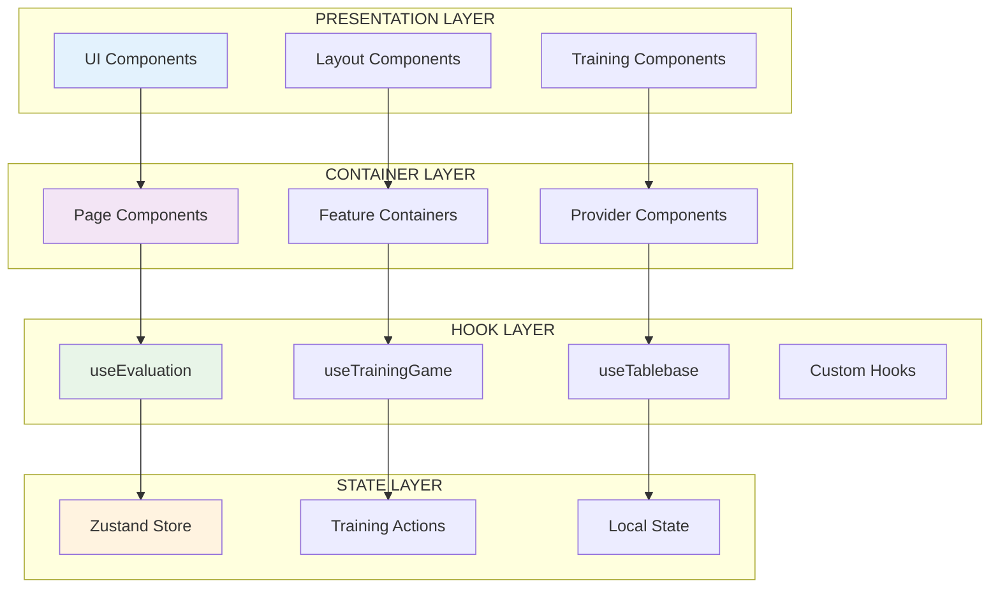

# React Component Patterns

**Target**: LLM comprehension for React patterns and component architecture
**Environment**: WSL + VS Code + Windows
**Updated**: 2025-07-13

## 🎯 React Architecture Patterns

### Component Architecture



## 📁 Component Structure with File References

```
shared/components/
├── chess/                     # Chess-specific UI components
│   └── Chessboard.tsx        # Lines 1-85   - Chess board display
├── layout/                   # Layout and structure components
│   ├── AppLayout.tsx         # Lines 1-120  - Main app layout
│   └── Header.tsx            # Lines 1-65   - Application header
├── training/                 # Training-specific components
│   ├── AnalysisPanel/        # Analysis display components
│   │   ├── index.tsx         # Lines 1-45   - Panel container
│   │   ├── AnalysisDetails.tsx # Lines 1-90  - Analysis details
│   │   └── MoveAnalysis.tsx  # Lines 1-110  - Move analysis
│   ├── DualEvaluationPanel/  # Evaluation display components
│   │   └── index.tsx         # Lines 1-121  - Panel with dual evaluation display
│   ├── TrainingBoard/        # Training board components
│   │   └── TrainingBoardZustand.tsx # Lines 1-150 - Board with state
│   ├── MovePanelZustand.tsx  # Lines 1-120  - Move panel with Zustand
│   └── PrincipalVariation.tsx # Lines 1-85  - PV display
└── ui/                       # Generic UI components
    ├── ErrorBoundary.tsx     # Lines 1-95   - Error handling
    ├── EngineErrorBoundary.tsx # Lines 1-80 - Engine-specific errors
    ├── button.tsx            # Lines 1-65   - Button component
    ├── Toast.tsx             # Lines 1-80   - Toast notifications
    └── DarkModeToggle.tsx    # Lines 1-50   - Dark mode toggle
```

## 🎨 Component Patterns

### 1. Container/Presentation Pattern

**Container Component** (Business Logic):

```typescript
// File: /shared/components/training/TrainingBoard/TrainingBoardZustand.tsx:25-60
export function TrainingBoardContainer() {
  // Container pattern: Handle business logic and state
  const {
    position,
    moves,
    currentMoveIndex,
    makeMove,
    navigateToMove
  } = useTrainingGame();

  const {
    lastEvaluation,
    isEvaluating
  } = useEvaluation({
    fen: position.fen(),
    isEnabled: true
  });

  // Container pattern: Event handlers
  const handleMove = useCallback((move: Move) => {
    makeMove(move);
  }, [makeMove]);

  const handleMoveNavigation = useCallback((index: number) => {
    navigateToMove(index);
  }, [navigateToMove]);

  // Container pattern: Pass data and handlers to presentation
  return (
    <TrainingBoardPresentation
      position={position}
      moves={moves}
      currentMoveIndex={currentMoveIndex}
      evaluation={lastEvaluation}
      isEvaluating={isEvaluating}
      onMove={handleMove}
      onMoveNavigation={handleMoveNavigation}
    />
  );
}
```

**Presentation Component** (UI Only):

```typescript
// File: /shared/components/training/TrainingBoard/TrainingBoardPresentation.tsx:15-45
interface TrainingBoardPresentationProps {
  position: Chess;
  moves: Move[];
  currentMoveIndex: number;
  evaluation: EvaluationData | null;
  isEvaluating: boolean;
  onMove: (move: Move) => void;
  onMoveNavigation: (index: number) => void;
}

export function TrainingBoardPresentation({
  position,
  moves,
  currentMoveIndex,
  evaluation,
  isEvaluating,
  onMove,
  onMoveNavigation
}: TrainingBoardPresentationProps) {
  // Presentation pattern: Pure UI rendering
  return (
    <div className="training-board">
      <Chessboard
        position={position.fen()}
        onMove={onMove}
        boardSize={400}
      />

      <div className="evaluation-display">
        {isEvaluating ? (
          <Spinner />
        ) : (
          <EvaluationCard evaluation={evaluation} />
        )}
      </div>

      <MoveHistory
        moves={moves}
        currentIndex={currentMoveIndex}
        onMoveClick={onMoveNavigation}
      />
    </div>
  );
}
```

### 2. Compound Component Pattern

**Main Component with Sub-components**:

```typescript
// File: /shared/components/training/DualEvaluationPanel/index.tsx
export function DualEvaluationPanel({ fen, isVisible }) {
  const { lastEvaluation, isEvaluating } = useEvaluation({
    fen,
    isEnabled: isVisible
  });

  return (
    <div className="dual-evaluation-panel">
      {/* Engine Multi-PV Display */}
      <div className="engine-evaluation-section">
        {lastEvaluation?.multiPvResults?.map((result, index) => (
          <div key={index}>{result.san} {formatScore(result.score)}</div>
        ))}
      </div>

      {/* Tablebase Moves Display */}
      <div className="tablebase-evaluation-section">
        {lastEvaluation?.tablebase?.topMoves?.map((move, index) => (
          <div key={index}>{move.san} DTZ {move.dtz}</div>
        ))}
      </div>
    </div>
  );
}
```

### 3. Hook Integration Pattern

**Component with Multiple Hooks**:

```typescript
// File: /shared/components/training/AnalysisPanel/AnalysisDetails.tsx:20-65
export function AnalysisDetails() {
  // Hook integration pattern: Combine multiple hooks
  const gameState = useTrainingStore(state => ({
    position: state.position,
    currentMove: state.currentMove,
    moveHistory: state.moveHistory
  }));

  const {
    lastEvaluation,
    evaluations,
    isEvaluating
  } = useEvaluation({
    fen: gameState.position.fen(),
    isEnabled: true,
    previousFen: gameState.moveHistory[gameState.moveHistory.length - 2]?.fen
  });

  const {
    bestMoves,
    analysis
  } = useAnalysisData({
    position: gameState.position,
    evaluation: lastEvaluation
  });

  // Hook integration pattern: Derived state
  const evaluationTrend = useMemo(() => {
    return calculateEvaluationTrend(evaluations);
  }, [evaluations]);

  // Hook integration pattern: Side effects
  useEffect(() => {
    if (lastEvaluation && lastEvaluation.tablebase) {
      // Log tablebase hits for analytics
      analytics.trackTablebaseHit(gameState.position.fen());
    }
  }, [lastEvaluation, gameState.position]);

  return (
    <div className="analysis-details">
      <EvaluationDisplay
        evaluation={lastEvaluation}
        trend={evaluationTrend}
        isLoading={isEvaluating}
      />

      <BestMovesDisplay moves={bestMoves} />

      <MoveAnalysis analysis={analysis} />
    </div>
  );
}
```

## 🔄 State Integration Patterns

### 1. Store Connection Pattern

**Direct Store Access**:

```typescript
// File: /shared/components/training/NavigationControls.tsx:15-40
export function NavigationControls() {
  // Store connection pattern: Direct access with selectors
  const {
    canGoBack,
    canGoForward,
    currentMoveIndex,
    totalMoves
  } = useTrainingStore(state => ({
    canGoBack: state.currentMoveIndex > 0,
    canGoForward: state.currentMoveIndex < state.moveHistory.length - 1,
    currentMoveIndex: state.currentMoveIndex,
    totalMoves: state.moveHistory.length
  }));

  // Store connection pattern: Action dispatchers
  const navigateToMove = useTrainingStore(state => state.navigateToMove);
  const goBack = useCallback(() => {
    if (canGoBack) {
      navigateToMove(currentMoveIndex - 1);
    }
  }, [canGoBack, currentMoveIndex, navigateToMove]);

  const goForward = useCallback(() => {
    if (canGoForward) {
      navigateToMove(currentMoveIndex + 1);
    }
  }, [canGoForward, currentMoveIndex, navigateToMove]);

  return (
    <div className="navigation-controls">
      <button
        onClick={goBack}
        disabled={!canGoBack}
        aria-label="Previous move"
      >
        ←
      </button>

      <span>{currentMoveIndex + 1} / {totalMoves}</span>

      <button
        onClick={goForward}
        disabled={!canGoForward}
        aria-label="Next move"
      >
        →
      </button>
    </div>
  );
}
```

### 2. Optimized Selector Pattern

**Performance-Optimized Selectors**:

```typescript
// File: /shared/components/training/MoveHistory.tsx:20-50
export function MoveHistory() {
  // Optimized selector pattern: Only re-render when moves change
  const moves = useTrainingStore(
    state => state.moveHistory,
    shallow // Zustand shallow comparison
  );

  const currentMoveIndex = useTrainingStore(state => state.currentMoveIndex);

  // Optimized selector pattern: Derived state with useMemo
  const formattedMoves = useMemo(() => {
    return moves.map((move, index) => ({
      ...move,
      notation: move.san,
      isActive: index === currentMoveIndex,
      moveNumber: Math.floor(index / 2) + 1,
      isWhiteMove: index % 2 === 0
    }));
  }, [moves, currentMoveIndex]);

  // Optimized selector pattern: Stable action reference
  const navigateToMove = useTrainingStore(state => state.navigateToMove);

  return (
    <div className="move-history">
      {formattedMoves.map((move, index) => (
        <MoveButton
          key={`${move.moveNumber}-${move.isWhiteMove ? 'w' : 'b'}`}
          move={move}
          isActive={move.isActive}
          onClick={() => navigateToMove(index)}
        />
      ))}
    </div>
  );
}
```

## 🎯 Error Handling Patterns

### 1. Error Boundary Pattern

**Error Boundary Component**:

```typescript
// File: /shared/components/ui/ErrorBoundary.tsx:15-70
interface ErrorBoundaryState {
  hasError: boolean;
  error: Error | null;
  errorInfo: ErrorInfo | null;
}

export class ErrorBoundary extends Component<
  PropsWithChildren<ErrorBoundaryProps>,
  ErrorBoundaryState
> {
  constructor(props: PropsWithChildren<ErrorBoundaryProps>) {
    super(props);

    this.state = {
      hasError: false,
      error: null,
      errorInfo: null
    };
  }

  static getDerivedStateFromError(error: Error): Partial<ErrorBoundaryState> {
    // Error boundary pattern: Update state on error
    return {
      hasError: true,
      error
    };
  }

  componentDidCatch(error: Error, errorInfo: ErrorInfo) {
    // Error boundary pattern: Log error details
    console.error('ErrorBoundary caught an error:', error, errorInfo);

    this.setState({
      error,
      errorInfo
    });

    // Error boundary pattern: Report to error service
    ErrorService.logError('React Error Boundary', error, {
      componentStack: errorInfo.componentStack,
      errorBoundary: this.props.fallbackComponent?.name || 'Unknown'
    });
  }

  render() {
    if (this.state.hasError) {
      // Error boundary pattern: Fallback UI
      const FallbackComponent = this.props.fallbackComponent || DefaultErrorFallback;

      return (
        <FallbackComponent
          error={this.state.error}
          resetError={() => this.setState({ hasError: false, error: null })}
        />
      );
    }

    return this.props.children;
  }
}

// Error boundary pattern: Specialized engine error boundary
export function EngineErrorBoundary({ children }: PropsWithChildren) {
  return (
    <ErrorBoundary
      fallbackComponent={EngineErrorFallback}
    >
      {children}
    </ErrorBoundary>
  );
}
```

### 2. Hook Error Handling Pattern

**Error Handling in Hooks**:

```typescript
// File: /shared/hooks/useEvaluation.ts:195-220
export function useEvaluation(params: UseEvaluationParams) {
  const [error, setError] = useState<string | null>(null);
  const [isEvaluating, setIsEvaluating] = useState(false);

  // Hook error handling pattern: Centralized error handler
  const handleEvaluationError = useCallback(
    (error: Error) => {
      // Don't set error state for intentional cancellations
      if (error.name === "AbortError") {
        return;
      }

      // Hook error handling pattern: User-friendly error messages
      const userMessage = getEvaluationErrorMessage(error);
      setError(userMessage);
      setIsEvaluating(false);

      // Hook error handling pattern: Error logging
      console.error("Evaluation error:", {
        error: error.message,
        fen: params.fen,
        timestamp: new Date().toISOString(),
      });
    },
    [params.fen],
  );

  const evaluatePosition = useCallback(
    async (fen: string) => {
      try {
        setIsEvaluating(true);
        setError(null);

        const result = await service.getFormattedEvaluation(fen, playerToMove);

        // Success - update state
        updateEvaluationState(result);
      } catch (error) {
        handleEvaluationError(error as Error);
      } finally {
        setIsEvaluating(false);
      }
    },
    [service, handleEvaluationError],
  );

  return {
    error,
    isEvaluating,
    // ... other hook returns
  };
}
```

## 🧪 Testing Patterns

### 1. Component Testing Pattern

**Component Unit Testing**:

```typescript
// File: /tests/unit/components/training/NavigationControls.test.tsx:15-50
describe('NavigationControls', () => {
  let mockStore: any;

  beforeEach(() => {
    // Testing pattern: Mock store setup
    mockStore = {
      currentMoveIndex: 2,
      moveHistory: [
        { san: 'e4' },
        { san: 'e5' },
        { san: 'Nf3' },
        { san: 'Nc6' }
      ],
      navigateToMove: jest.fn()
    };

    // Testing pattern: Mock Zustand store
    (useTrainingStore as jest.Mock).mockImplementation((selector) => {
      return selector(mockStore);
    });
  });

  it('should display correct move position', () => {
    const { getByText } = render(<NavigationControls />);

    // Testing pattern: State-based assertions
    expect(getByText('3 / 4')).toBeInTheDocument();
  });

  it('should handle navigation correctly', () => {
    const { getByLabelText } = render(<NavigationControls />);

    const backButton = getByLabelText('Previous move');
    const forwardButton = getByLabelText('Next move');

    // Testing pattern: Interaction testing
    fireEvent.click(backButton);
    expect(mockStore.navigateToMove).toHaveBeenCalledWith(1);

    fireEvent.click(forwardButton);
    expect(mockStore.navigateToMove).toHaveBeenCalledWith(3);
  });

  it('should disable buttons appropriately', () => {
    // Testing pattern: Edge case testing
    mockStore.currentMoveIndex = 0;

    const { getByLabelText } = render(<NavigationControls />);

    expect(getByLabelText('Previous move')).toBeDisabled();
    expect(getByLabelText('Next move')).not.toBeDisabled();
  });
});
```

### 2. Hook Testing Pattern

**Custom Hook Testing**:

```typescript
// File: /tests/unit/hooks/useEvaluation.test.ts:100-130
describe("useEvaluation Hook", () => {
  beforeEach(() => {
    // Hook testing pattern: Mock dependencies
    mockUnifiedService.getFormattedEvaluation.mockResolvedValue(
      mockFormattedEvaluation,
    );
  });

  it("should evaluate position when enabled", async () => {
    const { result } = renderHook(() =>
      useEvaluation({
        fen: TEST_FENS.STARTING_POSITION,
        isEnabled: true,
      }),
    );

    // Hook testing pattern: Wait for async operations
    await waitFor(() => {
      expect(result.current.isEvaluating).toBe(false);
    });

    // Hook testing pattern: Service call verification
    expect(mockUnifiedService.getFormattedEvaluation).toHaveBeenCalledWith(
      TEST_FENS.STARTING_POSITION,
      "w",
    );
  });

  it("should handle error states correctly", async () => {
    const testError = new Error("Evaluation failed");
    mockUnifiedService.getFormattedEvaluation.mockRejectedValue(testError);

    const { result } = renderHook(() =>
      useEvaluation({
        fen: TEST_FENS.STARTING_POSITION,
        isEnabled: true,
      }),
    );

    // Hook testing pattern: Error state verification
    await waitFor(() => {
      expect(result.current.error).toBeTruthy();
    });
  });
});
```

## 🎨 Styling Patterns

### 1. CSS Module Pattern

**Component with CSS Modules**:

```typescript
// File: /shared/components/training/EvaluationLegend.tsx:10-30
import styles from './EvaluationLegend.module.css';

export function EvaluationLegend() {
  return (
    <div className={styles.legend}>
      <div className={styles.legendItem}>
        <span className={styles.colorIndicator} data-evaluation="winning" />
        <span className={styles.label}>Winning (+2.0 or better)</span>
      </div>

      <div className={styles.legendItem}>
        <span className={styles.colorIndicator} data-evaluation="advantage" />
        <span className={styles.label}>Advantage (+0.5 to +2.0)</span>
      </div>

      <div className={styles.legendItem}>
        <span className={styles.colorIndicator} data-evaluation="equal" />
        <span className={styles.label}>Equal (-0.5 to +0.5)</span>
      </div>
    </div>
  );
}
```

### 2. Tailwind CSS Pattern

**Component with Tailwind Classes**:

```typescript
// File: /shared/components/ui/Toast.tsx:20-45
interface ToastProps {
  message: string;
  type: 'success' | 'error' | 'warning' | 'info';
  onClose: () => void;
}

export function Toast({ message, type, onClose }: ToastProps) {
  // Tailwind pattern: Dynamic class composition
  const baseClasses = "fixed top-4 right-4 p-4 rounded-lg shadow-lg transition-all duration-300";
  const typeClasses = {
    success: "bg-green-500 text-white",
    error: "bg-red-500 text-white",
    warning: "bg-yellow-500 text-black",
    info: "bg-blue-500 text-white"
  };

  const className = `${baseClasses} ${typeClasses[type]}`;

  return (
    <div className={className}>
      <div className="flex items-center justify-between">
        <span>{message}</span>
        <button
          onClick={onClose}
          className="ml-4 text-lg hover:opacity-75"
        >
          ×
        </button>
      </div>
    </div>
  );
}
```

## 🚫 Anti-Patterns to Avoid

### 1. React Anti-Patterns

**❌ Prop Drilling**

```typescript
// BAD: Drilling props through multiple levels
function App() {
  const user = useAuth();
  return <Dashboard user={user} />;
}

function Dashboard({ user }) {
  return <Sidebar user={user} />;
}

function Sidebar({ user }) {
  return <UserProfile user={user} />;
}

// GOOD: Use store or context for deeply nested data
function UserProfile() {
  const user = useTrainingStore(state => state.user);
  return <div>{user.name}</div>;
}
```

**❌ Monolithic Components**

```typescript
// BAD: Single component handling multiple responsibilities
function TrainingPageMonolith() {
  // Game logic
  const [position, setPosition] = useState(new Chess());
  const [moveHistory, setMoveHistory] = useState([]);

  // UI state
  const [selectedSquare, setSelectedSquare] = useState(null);
  const [showAnalysis, setShowAnalysis] = useState(true);

  // Evaluation logic
  const [evaluation, setEvaluation] = useState(null);

  // Engine management
  const [engine, setEngine] = useState(null);

  // 200+ lines of mixed logic...

  return (
    <div>
      {/* Complex JSX mixing all concerns */}
    </div>
  );
}

// GOOD: Separate concerns with Container/Presentation pattern
function TrainingPage() {
  return (
    <TrainingPageContainer>
      <ChessboardPresentation />
      <AnalysisPanelPresentation />
      <GameControlsPresentation />
    </TrainingPageContainer>
  );
}
```

**❌ Business Logic in Presentation Components**

```typescript
// BAD: Complex calculations and side effects in presentation
function EvaluationDisplay({ fen }) {
  const [evaluation, setEvaluation] = useState(null);

  useEffect(() => {
    // Heavy computation in presentation component
    async function calculateEvaluation() {
      const engine = await getEngineInstance();
      const result = await engine.evaluate(fen);
      const formatted = formatEvaluationScore(result.score);
      setEvaluation(formatted);
    }
    calculateEvaluation();
  }, [fen]);

  return <div>{evaluation}</div>;
}

// GOOD: Business logic in hooks, presentation components pure
function EvaluationDisplay() {
  const { evaluation, isEvaluating } = useEvaluation();

  if (isEvaluating) return <Spinner />;
  return <div>{evaluation}</div>;
}
```

**❌ Unstable References**

```typescript
// BAD: Creating new objects/functions on every render
function MoveHistory() {
  const moves = useTrainingStore(state => state.moveHistory);

  return (
    <div>
      {moves.map((move, index) => (
        <button
          key={index}
          onClick={() => navigateToMove(index)} // New function every render
          style={{ color: index === currentIndex ? 'blue' : 'black' }} // New object every render
        >
          {move.san}
        </button>
      ))}
    </div>
  );
}

// GOOD: Stable references with useCallback and useMemo
function MoveHistory() {
  const moves = useTrainingStore(state => state.moveHistory);
  const navigateToMove = useTrainingStore(state => state.navigateToMove);

  const handleMoveClick = useCallback((index) => {
    navigateToMove(index);
  }, [navigateToMove]);

  return (
    <div>
      {moves.map((move, index) => (
        <MoveButton
          key={index}
          move={move}
          isActive={index === currentIndex}
          onClick={handleMoveClick}
        />
      ))}
    </div>
  );
}
```

### 2. Hook Anti-Patterns

**❌ Hooks with Side Effects in Render**

```typescript
// BAD: Side effects during render
function useEvaluation(fen) {
  const [evaluation, setEvaluation] = useState(null);

  // NEVER: Side effects in render
  if (fen && !evaluation) {
    evaluatePosition(fen).then(setEvaluation);
  }

  return evaluation;
}

// GOOD: Side effects in useEffect
function useEvaluation(fen) {
  const [evaluation, setEvaluation] = useState(null);

  useEffect(() => {
    if (fen) {
      evaluatePosition(fen).then(setEvaluation);
    }
  }, [fen]);

  return evaluation;
}
```

**❌ Missing Dependency Arrays**

```typescript
// BAD: Missing or incorrect dependencies
function useEngine() {
  const [engine, setEngine] = useState(null);

  useEffect(() => {
    initializeEngine().then(setEngine);
  }); // Missing dependency array - runs every render!

  useEffect(() => {
    if (engine) {
      engine.configure(settings);
    }
  }, []); // Missing 'engine' and 'settings' dependencies

  return engine;
}

// GOOD: Correct dependency arrays
function useEngine() {
  const [engine, setEngine] = useState(null);
  const settings = useTrainingStore((state) => state.engineSettings);

  useEffect(() => {
    initializeEngine().then(setEngine);
  }, []); // Correct: empty array for one-time initialization

  useEffect(() => {
    if (engine && settings) {
      engine.configure(settings);
    }
  }, [engine, settings]); // Correct: all dependencies listed

  return engine;
}
```

### 3. Error Handling Anti-Patterns

**❌ Silent Error Swallowing**

```typescript
// BAD: Silently catching and ignoring errors
function useEvaluation(fen) {
  const [evaluation, setEvaluation] = useState(null);

  useEffect(() => {
    evaluatePosition(fen)
      .then(setEvaluation)
      .catch(() => {}); // Silent failure - user never knows!
  }, [fen]);

  return evaluation;
}

// GOOD: Proper error handling with user feedback
function useEvaluation(fen) {
  const [evaluation, setEvaluation] = useState(null);
  const [error, setError] = useState(null);

  useEffect(() => {
    setError(null);
    evaluatePosition(fen)
      .then(setEvaluation)
      .catch((err) => {
        console.error("Evaluation failed:", err);
        setError("Failed to evaluate position");
      });
  }, [fen]);

  return { evaluation, error };
}
```

---

**Next**: Review [ZUSTAND_PATTERNS.md](./ZUSTAND_PATTERNS.md) for state management patterns.
