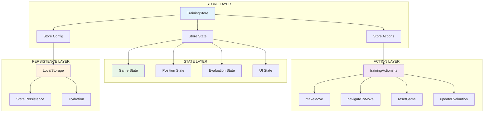

# Zustand State Management Patterns

**Target**: LLM comprehension for Zustand store patterns and state management
**Environment**: WSL + VS Code + Windows  
**Updated**: 2025-07-13

## 🎯 Zustand Store Architecture

### Store Structure Overview



## 📁 Store Structure with File References

```
shared/store/
├── store.ts              # Lines 1-120  - Main store definition
├── trainingActions.ts    # Lines 1-180  - Action implementations
├── storeConfig.ts        # Lines 1-85   - Store configuration
├── types.ts              # Lines 1-95   - Store type definitions
└── index.ts              # Lines 1-25   - Store exports
```

## 🏗️ Store Definition Pattern

### Main Store Implementation

**File**: `/shared/store/store.ts:15-80`

```typescript
import { create } from "zustand";
import { devtools, persist } from "zustand/middleware";
import { immer } from "zustand/middleware/immer";
import type { TrainingStore } from "./types";
import { trainingActions } from "./trainingActions";

export const useTrainingStore = create<TrainingStore>()(
  // Store pattern: Middleware composition
  devtools(
    persist(
      immer((set, get) => ({
        // STATE DEFINITION
        // Game state
        position: new Chess(), // Current position
        moveHistory: [], // Complete move history
        currentMoveIndex: -1, // Current position in history

        // Evaluation state
        evaluations: [], // Evaluation history
        currentEvaluation: null, // Current position evaluation

        // UI state
        isAnalysisVisible: true,
        selectedSquare: null,
        highlightedSquares: [],

        // Training state
        trainingMode: "freeplay",
        targetEndgame: null,
        mistakeCount: 0,

        // ACTION BINDING
        // Store pattern: Bind actions with context
        ...trainingActions(set, get),

        // COMPUTED VALUES
        // Store pattern: Derived state getters
        get canUndo() {
          return get().currentMoveIndex >= 0;
        },

        get canRedo() {
          const state = get();
          return state.currentMoveIndex < state.moveHistory.length - 1;
        },

        get currentFen() {
          return get().position.fen();
        },

        get gameStatus() {
          const position = get().position;
          if (position.isCheckmate()) return "checkmate";
          if (position.isStalemate()) return "stalemate";
          if (position.isDraw()) return "draw";
          return "ongoing";
        },
      })),
      {
        name: "training-store",
        partialize: (state) => ({
          // Store pattern: Selective persistence
          moveHistory: state.moveHistory,
          currentMoveIndex: state.currentMoveIndex,
          trainingMode: state.trainingMode,
          isAnalysisVisible: state.isAnalysisVisible,
          // Note: Don't persist Chess instance or evaluation data
        }),
      },
    ),
    {
      name: "EndgameTrainer Store",
    },
  ),
);
```

### Store Configuration Pattern

**File**: `/shared/store/storeConfig.ts:10-40`

```typescript
import type { StateStorage } from "zustand/middleware";

// Store pattern: Custom storage adapter
const createCustomStorage = (): StateStorage => {
  return {
    getItem: (name) => {
      try {
        const item = localStorage.getItem(name);
        return item ? JSON.parse(item) : null;
      } catch (error) {
        console.warn(`Failed to load state from localStorage:`, error);
        return null;
      }
    },

    setItem: (name, value) => {
      try {
        localStorage.setItem(name, JSON.stringify(value));
      } catch (error) {
        console.warn(`Failed to save state to localStorage:`, error);
      }
    },

    removeItem: (name) => {
      try {
        localStorage.removeItem(name);
      } catch (error) {
        console.warn(`Failed to remove state from localStorage:`, error);
      }
    },
  };
};

// Store pattern: Environment-specific configuration
export const storeConfig = {
  storage: createCustomStorage(),
  version: 1,

  // Store pattern: Migration handling
  migrate: (persistedState: any, version: number) => {
    if (version === 0) {
      // Migrate from version 0 to 1
      return {
        ...persistedState,
        trainingMode: persistedState.mode || "freeplay",
      };
    }
    return persistedState;
  },
};
```

## 🎯 Action Patterns

### Action Implementation

**File**: `/shared/store/trainingActions.ts:20-120`

```typescript
import { Chess } from "chess.js";
import type { TrainingStoreActions, Move } from "./types";

export const trainingActions = (set: any, get: any): TrainingStoreActions => ({
  // Action pattern: Game state mutations
  makeMove: (move: Move) => {
    set((state) => {
      // Action pattern: Immer mutation
      const newPosition = new Chess(state.position.fen());

      try {
        // Validate and make move
        const madeMove = newPosition.move(move);

        if (!madeMove) {
          throw new Error(`Invalid move: ${JSON.stringify(move)}`);
        }

        // Update position
        state.position = newPosition;

        // Action pattern: History management
        // Remove any moves after current index (for branching)
        state.moveHistory = state.moveHistory.slice(
          0,
          state.currentMoveIndex + 1,
        );

        // Add new move to history
        state.moveHistory.push({
          move: madeMove,
          fen: newPosition.fen(),
          san: madeMove.san,
          timestamp: Date.now(),
        });

        // Update current index
        state.currentMoveIndex = state.moveHistory.length - 1;

        // Clear evaluation for new position
        state.currentEvaluation = null;

        // Action pattern: Side effects
        // Clear UI highlights
        state.selectedSquare = null;
        state.highlightedSquares = [];
      } catch (error) {
        console.error("Failed to make move:", error);
        // Action pattern: Error handling without state change
        throw error;
      }
    });
  },

  // Action pattern: Navigation actions
  navigateToMove: (moveIndex: number) => {
    set((state) => {
      const maxIndex = state.moveHistory.length - 1;
      const clampedIndex = Math.max(-1, Math.min(moveIndex, maxIndex));

      // Action pattern: Position reconstruction
      const newPosition = new Chess();

      // Replay moves up to target index
      for (let i = 0; i <= clampedIndex; i++) {
        const historyMove = state.moveHistory[i];
        newPosition.move(historyMove.move);
      }

      // Update state
      state.position = newPosition;
      state.currentMoveIndex = clampedIndex;
      state.currentEvaluation = null;

      // Clear UI state
      state.selectedSquare = null;
      state.highlightedSquares = [];
    });
  },

  // Action pattern: Game reset
  resetGame: () => {
    set((state) => {
      // Action pattern: Complete state reset
      state.position = new Chess();
      state.moveHistory = [];
      state.currentMoveIndex = -1;
      state.evaluations = [];
      state.currentEvaluation = null;
      state.mistakeCount = 0;

      // Preserve UI preferences
      // state.isAnalysisVisible unchanged
      // state.trainingMode unchanged

      // Clear UI state
      state.selectedSquare = null;
      state.highlightedSquares = [];
    });
  },

  // Action pattern: Evaluation updates
  updateEvaluation: (evaluation: EvaluationData) => {
    set((state) => {
      // Action pattern: Conditional updates
      const currentFen = state.position.fen();

      // Only update if evaluation matches current position
      if (evaluation.fen === currentFen) {
        state.currentEvaluation = evaluation;

        // Action pattern: History tracking
        // Add to evaluation history if not duplicate
        const lastEval = state.evaluations[state.evaluations.length - 1];
        if (!lastEval || lastEval.fen !== currentFen) {
          state.evaluations.push({
            ...evaluation,
            moveIndex: state.currentMoveIndex,
            timestamp: Date.now(),
          });
        }
      }
    });
  },

  // Action pattern: UI state management
  setAnalysisVisibility: (visible: boolean) => {
    set((state) => {
      state.isAnalysisVisible = visible;
    });
  },

  setSelectedSquare: (square: string | null) => {
    set((state) => {
      state.selectedSquare = square;
    });
  },

  setHighlightedSquares: (squares: string[]) => {
    set((state) => {
      state.highlightedSquares = squares;
    });
  },
});
```

## 📊 State Selection Patterns

### Optimized Selectors

**File**: Component using optimized selectors:

```typescript
// Pattern: Granular selectors for performance
export function GameControls() {
  // Selector pattern: Single value selectors
  const canUndo = useTrainingStore(state => state.canUndo);
  const canRedo = useTrainingStore(state => state.canRedo);
  const gameStatus = useTrainingStore(state => state.gameStatus);

  // Selector pattern: Action selectors
  const resetGame = useTrainingStore(state => state.resetGame);
  const navigateToMove = useTrainingStore(state => state.navigateToMove);

  // Selector pattern: Computed selectors
  const currentMoveIndex = useTrainingStore(state => state.currentMoveIndex);

  return (
    <div className="game-controls">
      <button
        onClick={() => navigateToMove(currentMoveIndex - 1)}
        disabled={!canUndo}
      >
        Undo
      </button>

      <button
        onClick={() => navigateToMove(currentMoveIndex + 1)}
        disabled={!canRedo}
      >
        Redo
      </button>

      <button onClick={resetGame}>
        Reset
      </button>

      <span>Status: {gameStatus}</span>
    </div>
  );
}
```

### Shallow Comparison Pattern

**File**: Component with shallow comparison:

```typescript
import { shallow } from 'zustand/shallow';

export function MoveHistoryPanel() {
  // Shallow pattern: Array/object comparison
  const { moveHistory, currentMoveIndex } = useTrainingStore(
    state => ({
      moveHistory: state.moveHistory,
      currentMoveIndex: state.currentMoveIndex
    }),
    shallow // Prevent re-renders on array content changes
  );

  // Shallow pattern: Action selectors
  const navigateToMove = useTrainingStore(state => state.navigateToMove);

  return (
    <div className="move-history">
      {moveHistory.map((move, index) => (
        <button
          key={index}
          onClick={() => navigateToMove(index)}
          className={index === currentMoveIndex ? 'active' : ''}
        >
          {move.san}
        </button>
      ))}
    </div>
  );
}
```

## 🔄 Side Effects Patterns

### Store Subscriptions

**File**: Hook for store subscriptions:

```typescript
// Pattern: External store subscriptions
export function useStoreSubscription() {
  useEffect(() => {
    // Subscription pattern: Listen to specific state changes
    const unsubscribe = useTrainingStore.subscribe(
      (state) => state.currentFen,
      (currentFen, previousFen) => {
        // Side effect pattern: Analytics tracking
        if (currentFen !== previousFen) {
          analytics.trackPositionChange(currentFen, previousFen);
        }
      },
    );

    return unsubscribe;
  }, []);

  useEffect(() => {
    // Subscription pattern: Game state changes
    const unsubscribe = useTrainingStore.subscribe(
      (state) => state.gameStatus,
      (gameStatus) => {
        // Side effect pattern: Game end handling
        if (gameStatus === "checkmate" || gameStatus === "stalemate") {
          analytics.trackGameEnd(gameStatus);
        }
      },
    );

    return unsubscribe;
  }, []);
}
```

### Action Side Effects

**File**: Enhanced actions with side effects:

```typescript
// Pattern: Actions with side effects
export const enhancedTrainingActions = (set: any, get: any) => ({
  ...trainingActions(set, get),

  // Side effect pattern: Action with async operations
  makeMoveWithAnalysis: async (move: Move) => {
    // Make the move first
    get().makeMove(move);

    // Side effect pattern: Trigger evaluation
    const currentFen = get().currentFen;

    try {
      // Side effect pattern: External service call
      const evaluation = await evaluationService.evaluate(currentFen);
      get().updateEvaluation(evaluation);

      // Side effect pattern: Conditional actions
      if (evaluation.isMistake) {
        set((state) => {
          state.mistakeCount += 1;
        });

        // Side effect pattern: UI feedback
        toast.show("Consider a different move", "warning");
      }
    } catch (error) {
      console.error("Failed to evaluate position:", error);
    }
  },

  // Side effect pattern: Batch operations
  loadGameFromPGN: (pgn: string) => {
    set((state) => {
      try {
        const chess = new Chess();
        chess.loadPgn(pgn);

        // Side effect pattern: Batch state updates
        const moves = chess.history({ verbose: true });

        // Reset state
        state.position = new Chess();
        state.moveHistory = [];
        state.currentMoveIndex = -1;

        // Replay all moves
        moves.forEach((move) => {
          const madeMove = state.position.move(move);
          state.moveHistory.push({
            move: madeMove,
            fen: state.position.fen(),
            san: madeMove.san,
            timestamp: Date.now(),
          });
          state.currentMoveIndex++;
        });
      } catch (error) {
        console.error("Failed to load PGN:", error);
        toast.show("Invalid PGN format", "error");
      }
    });
  },
});
```

## 🧪 Testing Patterns

### Store Testing

**File**: `/tests/unit/store/store.test.ts:20-80`

```typescript
describe("Training Store", () => {
  let store: any;

  beforeEach(() => {
    // Testing pattern: Fresh store instance
    store = useTrainingStore.getState();
    store.resetGame();
  });

  describe("makeMove", () => {
    it("should add move to history", () => {
      const initialMoveCount = store.moveHistory.length;

      // Testing pattern: Action testing
      store.makeMove({ from: "e2", to: "e4" });

      expect(store.moveHistory).toHaveLength(initialMoveCount + 1);
      expect(store.currentMoveIndex).toBe(0);
      expect(store.position.fen()).toContain("e4");
    });

    it("should handle invalid moves", () => {
      // Testing pattern: Error case testing
      expect(() => {
        store.makeMove({ from: "e2", to: "e5" }); // Invalid move
      }).toThrow("Invalid move");

      // State should remain unchanged
      expect(store.moveHistory).toHaveLength(0);
      expect(store.currentMoveIndex).toBe(-1);
    });
  });

  describe("navigateToMove", () => {
    beforeEach(() => {
      // Testing pattern: Setup test state
      store.makeMove({ from: "e2", to: "e4" });
      store.makeMove({ from: "e7", to: "e5" });
      store.makeMove({ from: "g1", to: "f3" });
    });

    it("should navigate to specific move", () => {
      store.navigateToMove(1);

      expect(store.currentMoveIndex).toBe(1);
      expect(store.position.history()).toEqual(["e4", "e5"]);
    });

    it("should handle out-of-bounds navigation", () => {
      store.navigateToMove(10); // Out of bounds

      // Should clamp to last move
      expect(store.currentMoveIndex).toBe(2);
      expect(store.position.history()).toEqual(["e4", "e5", "Nf3"]);
    });
  });
});
```

### Component Integration Testing

**File**: Component integration test:

```typescript
describe('Store Integration', () => {
  it('should update component when store changes', () => {
    const TestComponent = () => {
      const moveCount = useTrainingStore(state => state.moveHistory.length);
      const makeMove = useTrainingStore(state => state.makeMove);

      return (
        <div>
          <span data-testid="move-count">{moveCount}</span>
          <button
            data-testid="make-move"
            onClick={() => makeMove({ from: 'e2', to: 'e4' })}
          >
            Make Move
          </button>
        </div>
      );
    };

    const { getByTestId } = render(<TestComponent />);

    expect(getByTestId('move-count')).toHaveTextContent('0');

    // Testing pattern: Store interaction through component
    fireEvent.click(getByTestId('make-move'));

    expect(getByTestId('move-count')).toHaveTextContent('1');
  });
});
```

## 🎯 Performance Patterns

### Selector Optimization

**File**: Optimized selector patterns:

```typescript
// Pattern: Memoized selectors
const selectCurrentMove = (state: TrainingStore) =>
  state.moveHistory[state.currentMoveIndex];

const selectMoveAnalysis = (state: TrainingStore) => ({
  move: selectCurrentMove(state),
  evaluation: state.currentEvaluation,
  isAnalysisVisible: state.isAnalysisVisible
});

export function MoveAnalysisPanel() {
  // Performance pattern: Complex selector memoization
  const analysis = useTrainingStore(selectMoveAnalysis, shallow);

  // Performance pattern: Stable action references
  const setAnalysisVisibility = useTrainingStore(state => state.setAnalysisVisibility);

  if (!analysis.isAnalysisVisible) return null;

  return (
    <div className="move-analysis">
      {analysis.move && (
        <div>
          <h3>Move: {analysis.move.san}</h3>
          {analysis.evaluation && (
            <EvaluationDisplay evaluation={analysis.evaluation} />
          )}
        </div>
      )}

      <button onClick={() => setAnalysisVisibility(false)}>
        Hide Analysis
      </button>
    </div>
  );
}
```

### State Slicing Pattern

**File**: State slicing for large stores:

```typescript
// Pattern: State slicing for performance
export const useGameState = () =>
  useTrainingStore(
    (state) => ({
      position: state.position,
      currentMoveIndex: state.currentMoveIndex,
      gameStatus: state.gameStatus,
    }),
    shallow,
  );

export const useUIState = () =>
  useTrainingStore(
    (state) => ({
      selectedSquare: state.selectedSquare,
      highlightedSquares: state.highlightedSquares,
      isAnalysisVisible: state.isAnalysisVisible,
    }),
    shallow,
  );

export const useGameActions = () =>
  useTrainingStore((state) => ({
    makeMove: state.makeMove,
    navigateToMove: state.navigateToMove,
    resetGame: state.resetGame,
  }));
```

## 🚫 Anti-Patterns to Avoid

### 1. Zustand Store Anti-Patterns

**❌ God Store Pattern**

```typescript
// BAD: Single store handling all application concerns
export const useAppStore = create<AppStore>()((set, get) => ({
  // User management
  user: null,
  userPreferences: {},
  userSessions: [],
  userAnalytics: {},

  // Game state
  position: new Chess(),
  moveHistory: [],
  gameSettings: {},

  // UI state
  selectedSquare: null,
  modalState: {},
  toastMessages: [],

  // Analysis state
  analysisStatus: 'idle',
  tablebaseData: null,

  // Evaluation state
  evaluations: [],
  currentEvaluation: null,

  // Training state
  trainingProgress: {},
  achievements: [],

  // 100+ more properties and actions...
}));

// GOOD: Separate stores by domain
export const useUserStore = create<UserStore>()(...);
export const useTrainingStore = create<TrainingStore>()(...);
export const useUIStore = create<UIStore>()(...);
export const useAnalysisStore = create<AnalysisStore>()(...);
```

**❌ Overly Broad Selectors**

```typescript
// BAD: Selecting entire store causes unnecessary re-renders
function TrainingComponent() {
  const store = useTrainingStore(state => state); // Re-renders on ANY store change

  return (
    <div>
      <div>Current FEN: {store.position.fen()}</div>
      <div>Move count: {store.moveHistory.length}</div>
    </div>
  );
}

// GOOD: Granular selectors for specific data
function TrainingComponent() {
  const currentFen = useTrainingStore(state => state.position.fen());
  const moveCount = useTrainingStore(state => state.moveHistory.length);

  return (
    <div>
      <div>Current FEN: {currentFen}</div>
      <div>Move count: {moveCount}</div>
    </div>
  );
}
```

**❌ Storing Non-Serializable Data**

```typescript
// BAD: Storing functions, promises, and complex objects in state
export const useTrainingStore = create<TrainingStore>()(
  persist(
    (set, get) => ({
      position: new Chess(), // Chess.js instance - not serializable!

      evaluationPromise: null as Promise<Evaluation> | null, // Promise - not serializable!

      onMoveCallback: () => {}, // Function - not serializable!

      // Removed: engineWorker (no longer used in tablebase-only architecture)

      makeMove: (move) => {
        // Actions are fine - they're not persisted
        set((state) => {
          state.position.move(move);
        });
      },
    }),
    {
      name: "training-store",
      // This will break serialization!
    },
  ),
);

// GOOD: Store only serializable data, compute derived values
export const useTrainingStore = create<TrainingStore>()(
  persist(
    (set, get) => ({
      // Serializable state only
      currentFen: "rnbqkbnr/pppppppp/8/8/8/8/PPPPPPPP/RNBQKBNR w KQkq - 0 1",
      moveHistory: [],
      currentMoveIndex: -1,

      // Computed getters for complex objects
      get position() {
        const chess = new Chess();
        const history = get().moveHistory;
        const index = get().currentMoveIndex;

        // Replay moves up to current index
        for (let i = 0; i <= index; i++) {
          chess.move(history[i].move);
        }

        return chess;
      },
    }),
    {
      name: "training-store",
      partialize: (state) => ({
        currentFen: state.currentFen,
        moveHistory: state.moveHistory,
        currentMoveIndex: state.currentMoveIndex,
      }),
    },
  ),
);
```

**❌ Direct State Mutation**

```typescript
// BAD: Mutating state directly without Immer
export const useTrainingStore = create<TrainingStore>()((set, get) => ({
  moveHistory: [],

  addMove: (move) => {
    set((state) => {
      // Direct mutation - breaks Zustand's change detection!
      state.moveHistory.push(move);
      return state; // This won't trigger re-renders
    });
  },
}));

// GOOD: Using Immer middleware for safe mutations
export const useTrainingStore = create<TrainingStore>()(
  immer((set, get) => ({
    moveHistory: [],

    addMove: (move) => {
      set((state) => {
        // Immer handles immutable updates
        state.moveHistory.push(move);
      });
    },
  })),
);
```

### 2. Action Anti-Patterns

**❌ Actions with Side Effects in State Updates**

```typescript
// BAD: Side effects during state updates
export const trainingActions = (set: any, get: any) => ({
  makeMove: (move: Move) => {
    set((state) => {
      state.position.move(move);
      state.moveHistory.push(move);

      // BAD: Side effects in state update
      fetch("/api/analytics", {
        method: "POST",
        body: JSON.stringify({ move }),
      });

      // BAD: DOM manipulation in state update
      document.title = `Move ${state.moveHistory.length}`;

      // BAD: Async operations in state update
      evaluatePosition(state.position.fen()).then((eval) => {
        state.currentEvaluation = eval; // This won't trigger re-renders!
      });
    });
  },
});

// GOOD: Separate state updates from side effects
export const trainingActions = (set: any, get: any) => ({
  makeMove: async (move: Move) => {
    // State update first
    set((state) => {
      state.position.move(move);
      state.moveHistory.push(move);
    });

    // Side effects after state update
    const currentState = get();

    // Analytics
    analytics.trackMove(move);

    // DOM updates
    document.title = `Move ${currentState.moveHistory.length}`;

    // Async evaluation
    try {
      const evaluation = await evaluatePosition(currentState.currentFen);
      set((state) => {
        state.currentEvaluation = evaluation;
      });
    } catch (error) {
      console.error("Evaluation failed:", error);
    }
  },
});
```

**❌ Complex Business Logic in Actions**

```typescript
// BAD: Complex game logic mixed with state management
export const trainingActions = (set: any, get: any) => ({
  processUserMove: (move: Move) => {
    set((state) => {
      // Complex validation logic in action
      const position = new Chess(state.currentFen);

      if (!position.move(move)) {
        throw new Error("Invalid move");
      }

      // Complex endgame detection logic
      if (position.isCheckmate()) {
        if (position.turn() === "b") {
          state.gameResult = "white-wins";
          state.score += calculateWinBonus(state.moveHistory.length);
          state.achievements = updateAchievements(
            state.achievements,
            "checkmate-win",
          );
        } else {
          state.gameResult = "black-wins";
          state.mistakes += 1;
        }
      } else if (position.isStalemate() || position.isDraw()) {
        state.gameResult = "draw";
        state.score += calculateDrawBonus();
      }

      // Complex training feedback logic
      if (state.trainingMode === "endgame") {
        const difficulty = calculatePositionDifficulty(position.fen());
        if (difficulty > state.userSkillLevel + 2) {
          state.hints.push(generateHint(position));
        }
      }

      state.position = position;
      state.moveHistory.push(move);
    });
  },
});

// GOOD: Extract complex logic to separate services
export const trainingActions = (set: any, get: any) => ({
  processUserMove: (move: Move) => {
    const currentState = get();

    // Delegate complex logic to services
    const gameLogic = new GameLogicService(currentState);
    const trainingLogic = new TrainingLogicService(currentState);

    // Validate move
    const moveResult = gameLogic.validateAndMakeMove(move);
    if (!moveResult.isValid) {
      throw new Error(moveResult.error);
    }

    // Simple state update
    set((state) => {
      state.position = moveResult.newPosition;
      state.moveHistory.push(moveResult.move);

      if (moveResult.gameEnded) {
        state.gameResult = moveResult.result;
      }
    });

    // Handle training feedback separately
    trainingLogic.processMove(move, moveResult);
  },
});
```

### 3. Selector Anti-Patterns

**❌ Complex Calculations in Selectors**

```typescript
// BAD: Expensive calculations in selector
function AnalysisPanel() {
  const analysisData = useTrainingStore(state => {
    // Expensive calculation on every state change
    const moves = state.moveHistory;
    const evaluations = state.evaluations;

    // Heavy computation
    const blunderMoves = moves.filter((move, index) => {
      const prevEval = evaluations[index - 1]?.evaluation || 0;
      const currentEval = evaluations[index]?.evaluation || 0;
      return Math.abs(currentEval - prevEval) > 100;
    });

    const averageTime = moves.reduce((sum, move) => sum + move.timeSpent, 0) / moves.length;

    return {
      blunderCount: blunderMoves.length,
      averageTime,
      accuracy: calculateAccuracy(moves, evaluations) // More expensive calculation
    };
  });

  return <div>{/* Render analysis */}</div>;
}

// GOOD: Memoize expensive calculations
function AnalysisPanel() {
  const moves = useTrainingStore(state => state.moveHistory);
  const evaluations = useTrainingStore(state => state.evaluations);

  // Memoize expensive calculations
  const analysisData = useMemo(() => {
    const blunderMoves = moves.filter((move, index) => {
      const prevEval = evaluations[index - 1]?.evaluation || 0;
      const currentEval = evaluations[index]?.evaluation || 0;
      return Math.abs(currentEval - prevEval) > 100;
    });

    const averageTime = moves.reduce((sum, move) => sum + move.timeSpent, 0) / moves.length;

    return {
      blunderCount: blunderMoves.length,
      averageTime,
      accuracy: calculateAccuracy(moves, evaluations)
    };
  }, [moves, evaluations]);

  return <div>{/* Render analysis */}</div>;
}
```

---

**Next**: Proceed to Phase 4 - PR process integration and workflow documentation.
