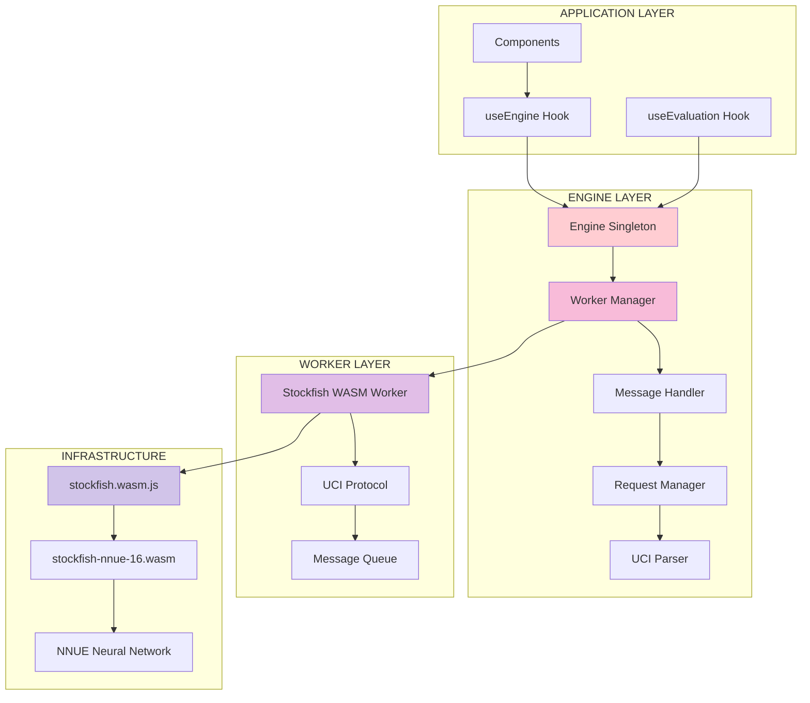

# Chess Engine Documentation

**Target**: LLM comprehension for chess engine patterns
**Environment**: WSL + VS Code + Windows
**Updated**: 2025-01-13

## 🎯 Engine Architecture

### Singleton Pattern Implementation



## 📁 File Structure with Line References

```
lib/chess/engine/
├── singleton.ts           # Lines 1-45   - Engine singleton management
├── workerManager.ts       # Lines 1-120  - Worker lifecycle management
├── messageHandler.ts      # Lines 1-180  - UCI message processing
├── requestManager.ts      # Lines 1-95   - Request/response handling
├── uciParser.ts          # Lines 1-250  - UCI protocol parsing
├── state.ts              # Lines 1-65   - Engine state management
├── types.ts              # Lines 1-85   - Type definitions
└── index.ts              # Lines 1-25   - Engine exports
```

## 🔧 Singleton Pattern Implementation

### Engine Singleton

**File**: `/shared/lib/chess/engine/singleton.ts:10-45`
```typescript
class EngineSingleton {
  private static instance: Engine | null = null;
  private static isInitializing = false;
  
  /**
   * Get the singleton engine instance
   * Implements lazy initialization with thread safety
   */
  static async getInstance(): Promise<Engine> {
    // Double-checked locking pattern
    if (!this.instance && !this.isInitializing) {
      this.isInitializing = true;
      
      try {
        // Expensive initialization only when needed
        this.instance = await this.createEngine();
      } finally {
        this.isInitializing = false;
      }
    }
    
    // Wait for initialization if in progress
    while (this.isInitializing) {
      await new Promise(resolve => setTimeout(resolve, 10));
    }
    
    if (!this.instance) {
      throw new Error('Failed to initialize engine singleton');
    }
    
    return this.instance;
  }
  
  /**
   * Create new engine instance with proper configuration
   */
  private static async createEngine(): Promise<Engine> {
    const workerManager = new WorkerManager({
      wasmPath: '/stockfish.wasm.js',
      nnuePath: '/stockfish-nnue-16.wasm',
      timeout: 30000
    });
    
    const engine = new Engine(workerManager);
    await engine.initialize();
    
    return engine;
  }
  
  /**
   * Clean disposal of singleton (critical for memory management)
   */
  static async dispose(): Promise<void> {
    if (this.instance) {
      await this.instance.quit();
      this.instance = null;
    }
  }
}

// Export singleton interface
export const engine = {
  getInstance: () => EngineSingleton.getInstance(),
  dispose: () => EngineSingleton.dispose()
};
```

### Memory Management Pattern

**File**: `/shared/lib/chess/engine/singleton.ts:50-75`
```typescript
/**
 * Memory-conscious engine lifecycle management
 * Critical for mobile platforms with ~20MB worker limits
 */
export class EngineLifecycleManager {
  private static cleanupHandlers: (() => Promise<void>)[] = [];
  
  /**
   * Register cleanup handler for proper disposal
   */
  static registerCleanup(handler: () => Promise<void>): void {
    this.cleanupHandlers.push(handler);
  }
  
  /**
   * Execute all cleanup handlers
   * Called on page unload, component unmount
   */
  static async cleanup(): Promise<void> {
    await Promise.all(this.cleanupHandlers.map(handler => handler()));
    await EngineSingleton.dispose();
    this.cleanupHandlers = [];
  }
}

// Global cleanup registration
if (typeof window !== 'undefined') {
  window.addEventListener('beforeunload', () => {
    EngineLifecycleManager.cleanup();
  });
}
```

## 🔄 Worker Management Pattern

### WorkerManager Implementation

**File**: `/shared/lib/chess/engine/workerManager.ts:15-60`
```typescript
export class WorkerManager {
  private worker: Worker | null = null;
  private messageHandlers = new Map<string, (data: any) => void>();
  private isInitialized = false;
  
  constructor(private config: WorkerConfig) {}
  
  /**
   * Initialize worker with WASM loading
   */
  async initialize(): Promise<void> {
    if (this.isInitialized) return;
    
    try {
      // Create worker from WASM JavaScript wrapper
      this.worker = new Worker(this.config.wasmPath);
      
      // Set up message handling
      this.worker.onmessage = (event) => {
        this.handleWorkerMessage(event.data);
      };
      
      this.worker.onerror = (error) => {
        console.error('Worker error:', error);
        this.handleWorkerError(error);
      };
      
      // Wait for WASM module initialization
      await this.waitForInitialization();
      
      this.isInitialized = true;
    } catch (error) {
      throw new Error(`Failed to initialize worker: ${error.message}`);
    }
  }
  
  /**
   * Send UCI command to worker
   */
  async sendMessage(command: string): Promise<void> {
    if (!this.worker || !this.isInitialized) {
      throw new Error('Worker not initialized');
    }
    
    return new Promise((resolve, reject) => {
      const timeout = setTimeout(() => {
        reject(new Error(`Command timeout: ${command}`));
      }, this.config.timeout);
      
      this.worker!.postMessage({ command });
      
      // Wait for acknowledgment (simplified)
      const handler = () => {
        clearTimeout(timeout);
        resolve();
      };
      
      this.messageHandlers.set('ack', handler);
    });
  }
  
  /**
   * Critical: Proper worker disposal
   */
  async dispose(): Promise<void> {
    if (this.worker) {
      // Send quit command to Stockfish
      await this.sendMessage('quit');
      
      // Terminate worker
      this.worker.terminate();
      this.worker = null;
      this.isInitialized = false;
      this.messageHandlers.clear();
    }
  }
}
```

## 📨 Message Handling Pattern

### UCI Message Processing

**File**: `/shared/lib/chess/engine/messageHandler.ts:20-70`
```typescript
export class MessageHandler {
  private responseHandlers = new Map<string, (response: string) => void>();
  private evaluationCallback?: (evaluation: UCIEvaluation) => void;
  
  /**
   * Process incoming UCI messages from Stockfish
   */
  handleMessage(message: string): void {
    const trimmed = message.trim();
    
    if (trimmed.startsWith('info')) {
      this.handleInfoMessage(trimmed);
    } else if (trimmed.startsWith('bestmove')) {
      this.handleBestMoveMessage(trimmed);
    } else if (trimmed === 'readyok') {
      this.handleReadyOk();
    } else if (trimmed.startsWith('uciok')) {
      this.handleUciOk();
    }
  }
  
  /**
   * Process evaluation info messages
   */
  private handleInfoMessage(message: string): void {
    // Parse UCI info line for evaluation data
    const parseResult = parseInfo(message);
    
    if (parseResult.isValid && parseResult.evaluation) {
      // Convert to enhanced evaluation format
      const evaluation: UCIEvaluation = {
        score: parseResult.evaluation.score,
        mate: parseResult.evaluation.mate,
        depth: parseResult.evaluation.depth || 0,
        nodes: parseResult.evaluation.nodes || 0,
        time: parseResult.evaluation.time || 0,
        pv: parseResult.evaluation.pv || [],
        pvString: parseResult.evaluation.pvString || '',
        nps: parseResult.evaluation.nps || 0,
        hashfull: parseResult.evaluation.hashfull || 0,
        seldepth: parseResult.evaluation.seldepth,
        multipv: parseResult.evaluation.multipv || 1,
        currmove: parseResult.evaluation.currmove,
        currmovenumber: parseResult.evaluation.currmovenumber
      };
      
      // Notify evaluation callback
      if (this.evaluationCallback) {
        this.evaluationCallback(evaluation);
      }
    }
  }
  
  /**
   * Register callback for evaluation updates
   */
  onEvaluation(callback: (evaluation: UCIEvaluation) => void): void {
    this.evaluationCallback = callback;
  }
  
  /**
   * Clear all handlers (cleanup)
   */
  clearHandlers(): void {
    this.responseHandlers.clear();
    this.evaluationCallback = undefined;
  }
}
```

## 🎯 Enhanced Evaluation API

### Position Evaluation

**File**: `/shared/lib/chess/engine/singleton.ts:80-120`
```typescript
/**
 * Enhanced evaluation API with PV data
 * Used by EngineProviderAdapter for rich evaluation data
 */
export class Engine {
  private workerManager: WorkerManager;
  private messageHandler: MessageHandler;
  private requestManager: RequestManager;
  
  constructor(workerManager: WorkerManager) {
    this.workerManager = workerManager;
    this.messageHandler = new MessageHandler();
    this.requestManager = new RequestManager();
  }
  
  /**
   * Evaluate position with enhanced UCI data
   * Returns rich evaluation including PV, depth, nodes, etc.
   */
  async evaluatePositionEnhanced(
    fen: string, 
    multiPV: boolean = false
  ): Promise<UCIEvaluation | null> {
    try {
      // Validate FEN first
      if (!this.isValidFen(fen)) {
        throw new Error(`Invalid FEN: ${fen}`);
      }
      
      // Set up position
      await this.sendCommand(`position fen ${fen}`);
      
      // Configure multi-PV if requested
      if (multiPV) {
        await this.sendCommand('setoption name MultiPV value 3');
      }
      
      // Start evaluation with time limit
      const evaluation = await this.requestManager.requestEvaluation({
        command: 'go movetime 2000',
        timeout: 5000
      });
      
      return evaluation;
    } catch (error) {
      console.error('Engine evaluation error:', error);
      return null;
    }
  }
  
  /**
   * Legacy evaluation API for backward compatibility
   */
  async evaluatePosition(
    fen: string
  ): Promise<{ score: number; mate: number | null } | null> {
    const enhanced = await this.evaluatePositionEnhanced(fen);
    
    if (!enhanced) return null;
    
    return {
      score: enhanced.score,
      mate: enhanced.mate
    };
  }
  
  /**
   * Proper engine shutdown
   */
  async quit(): Promise<void> {
    await this.sendCommand('quit');
    await this.workerManager.dispose();
    this.messageHandler.clearHandlers();
  }
}
```

## 🔄 Request Management Pattern

### Request/Response Coordination

**File**: `/shared/lib/chess/engine/requestManager.ts:15-60`
```typescript
export class RequestManager {
  private activeRequests = new Map<string, PendingRequest>();
  private requestIdCounter = 0;
  
  /**
   * Request evaluation with timeout handling
   */
  async requestEvaluation(params: EvaluationRequest): Promise<UCIEvaluation | null> {
    const requestId = `eval_${++this.requestIdCounter}`;
    
    return new Promise((resolve, reject) => {
      // Set up timeout
      const timeout = setTimeout(() => {
        this.activeRequests.delete(requestId);
        reject(new Error(`Evaluation timeout after ${params.timeout}ms`));
      }, params.timeout);
      
      // Store pending request
      const pendingRequest: PendingRequest = {
        id: requestId,
        resolve,
        reject,
        timeout,
        startTime: Date.now()
      };
      
      this.activeRequests.set(requestId, pendingRequest);
      
      // Set up evaluation callback
      this.messageHandler.onEvaluation((evaluation: UCIEvaluation) => {
        const request = this.activeRequests.get(requestId);
        if (request) {
          clearTimeout(request.timeout);
          this.activeRequests.delete(requestId);
          resolve(evaluation);
        }
      });
      
      // Send command to engine
      this.workerManager.sendMessage(params.command).catch(reject);
    });
  }
  
  /**
   * Cancel all pending requests
   */
  cancelAllRequests(): void {
    for (const [requestId, request] of this.activeRequests) {
      clearTimeout(request.timeout);
      request.reject(new Error('Request cancelled'));
    }
    this.activeRequests.clear();
  }
}

interface PendingRequest {
  id: string;
  resolve: (value: UCIEvaluation | null) => void;
  reject: (error: Error) => void;
  timeout: NodeJS.Timeout;
  startTime: number;
}

interface EvaluationRequest {
  command: string;
  timeout: number;
}
```

## 🧪 Testing Patterns

### Engine Singleton Testing

**File**: `/tests/unit/lib/chess/engine/singleton.test.ts:20-50`
```typescript
describe('Engine Singleton', () => {
  afterEach(async () => {
    // Clean up singleton between tests
    await engine.dispose();
  });
  
  it('should return same instance on multiple calls', async () => {
    const instance1 = await engine.getInstance();
    const instance2 = await engine.getInstance();
    
    expect(instance1).toBe(instance2);
  });
  
  it('should initialize worker properly', async () => {
    const instance = await engine.getInstance();
    
    expect(instance).toBeDefined();
    expect(typeof instance.evaluatePositionEnhanced).toBe('function');
  });
  
  it('should handle concurrent initialization', async () => {
    // Start multiple initialization attempts
    const promises = Array.from({ length: 5 }, () => engine.getInstance());
    
    const instances = await Promise.all(promises);
    
    // All should be the same instance
    instances.forEach(instance => {
      expect(instance).toBe(instances[0]);
    });
  });
});
```

### Mock Engine for Testing

**File**: `/tests/__mocks__/engine.ts:10-30`
```typescript
export const mockEngine = {
  evaluatePositionEnhanced: jest.fn(),
  evaluatePosition: jest.fn(),
  quit: jest.fn(),
  sendCommand: jest.fn()
};

export const engine = {
  getInstance: jest.fn().mockResolvedValue(mockEngine),
  dispose: jest.fn()
};

// Mock enhanced evaluation response
export const mockEnhancedEvaluation: UCIEvaluation = {
  score: 150,
  mate: null,
  depth: 20,
  nodes: 1000000,
  time: 2000,
  pv: ['e2e4', 'e7e5', 'g1f3'],
  pvString: 'e2e4 e7e5 g1f3',
  nps: 500000,
  hashfull: 50,
  seldepth: 22,
  multipv: 1,
  currmove: 'e2e4',
  currmovenumber: 1
};
```

## 🎯 Integration Patterns

### Provider Adapter Integration

**File**: `/shared/lib/chess/evaluation/providerAdapters.ts:15-25`
```typescript
export class EngineProviderAdapter implements IEngineProvider {
  async getEvaluation(fen: string, playerToMove: 'w' | 'b'): Promise<EngineEvaluation | null> {
    try {
      // Use singleton engine for evaluation
      const engineInstance = await engine.getInstance();
      const enhancedEvaluation = await engineInstance.evaluatePositionEnhanced(fen, false);
      
      if (!enhancedEvaluation) return null;
      
      // Transform to provider format
      return this.transformToProviderFormat(enhancedEvaluation);
    } catch (error) {
      console.error('EngineProviderAdapter error:', error);
      return null;
    }
  }
}
```

## 🚀 Performance Characteristics

### Memory Management
- **Worker Memory**: ~20MB for Stockfish WASM + NNUE
- **Singleton Overhead**: Minimal (~1KB for management)
- **Message Queue**: Bounded queue with max 100 messages
- **Cleanup**: Automatic on page unload + manual disposal

### Evaluation Performance
- **Cold Start**: ~500ms (WASM loading)
- **Warm Evaluation**: ~100-2000ms depending on depth
- **Concurrent Requests**: Serialized through single worker
- **Timeout Handling**: Configurable per request (default 5s)

### Scalability Considerations
- **Single Worker**: Prevents memory bloat on mobile
- **Request Queuing**: FIFO order with timeout protection
- **Error Recovery**: Worker restart on fatal errors
- **Resource Cleanup**: Proper disposal prevents memory leaks

---

**Next**: Review [../evaluation/](../evaluation/) for evaluation pipeline integration patterns.